# USA Security Connect

**The whole guard-force platform, with a demo company you can sign in to.**

Scheduling, GPS time clock, post logs, payroll, invoicing and a client portal for a
Florida security contractor, **USA Security & Protection Group**. It covers guard tours,
time and attendance, incident reporting, supervision and billing, in one system:

- a **web app** for officers *and* the admin console,
- a **mobile app** built from one codebase for **Android and iPhone**, and
- a **client portal** where a site contact sees the service they are paying for.

All three talk to the same API, and the rules that decide "late", "missed check-in" or
"outside the geofence" live in one shared module so no surface can disagree with
another. One thing gets captured once: an officer's clock-in is the same record that
produces their timesheet, the client's coverage report and the invoice line.

**[Open the live demo](https://usa-security-connect.vercel.app/)** ·
**[Open the client portal](https://usa-security-connect.vercel.app/portal)** ·
**[Take the product tour](https://usa-security-connect.vercel.app/tour/)** ·
[Run it locally](#run-it-locally)

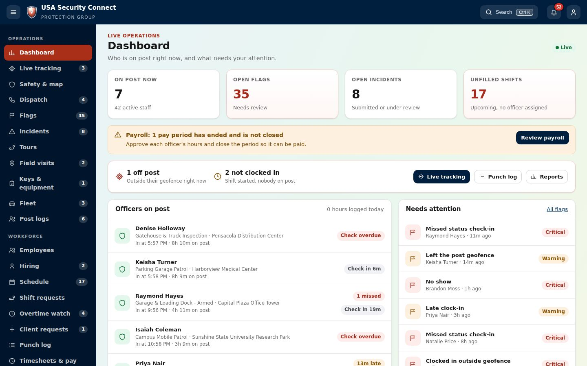

<table>
  <tr>
    <td width="26%" valign="top"><a href="docs/screenshots/officer-call.jpg">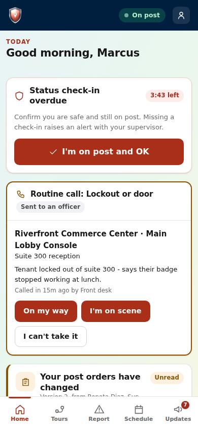</a><br><sub><b>Officer app.</b> A call from dispatch on the phone of the officer on post at Riverfront.</sub></td>
    <td width="37%" valign="top"><a href="docs/screenshots/portal-notices.jpg">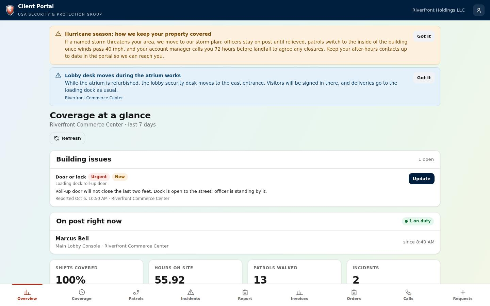</a><br><sub><b>Client portal.</b> Notices, building issues, who is on post and the week's coverage.</sub></td>
    <td width="37%" valign="top"><a href="docs/screenshots/payroll-period.jpg">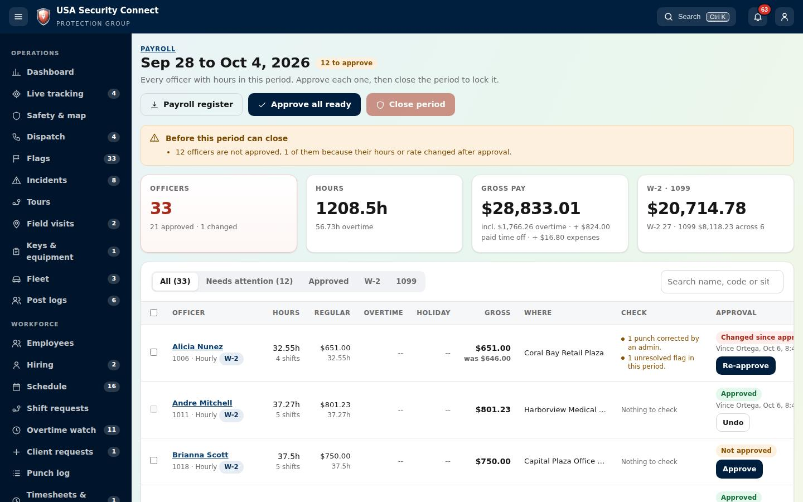</a><br><sub><b>Payroll.</b> A week reviewed officer by officer, with what needs a second look.</sub></td>
  </tr>
</table>

## Contents

- [Try the live demo](#try-the-live-demo): sign-ins and three five-minute walk-throughs
- [Feature tour](#feature-tour): every screen, with a picture of each, by area
- [Run it locally](#run-it-locally): setup, every demo account, the staff tiers and the mobile app
- [What it does, in detail](#what-it-does-in-detail): the officer app, the admin console and the client portal
- [How it is built](#how-it-is-built): layout, stack and time zones
- [Brand](#brand) · [Configuration](#configuration) · [Before going live](#before-going-live)
- [Tests](#tests): the API suites and the browser suites
- [Documentation](#documentation)

---

## Try the live demo

**[Take the product tour](https://usa-security-connect.vercel.app/tour/)**: every screen of
the admin console, the officer app and the client portal, with the demo sign-ins and
three five-minute walk-throughs, on one page. It is part of the site, at
[`/demo/`](https://usa-security-connect.vercel.app/demo/) and `/tour/` (the same page),
linked from the sign-in screens, the demo banner and the account menu.

### Demo sign-ins

| Sign in with | Who |
|---|---|
| `1001` / `2468` | Vince Ortega, administrator |
| `1002` / `3571` | Renata Diaz, field supervisor |
| `1003` / `4812` | Marcus Bell, officer on post now |
| `1005` / `6174` | Dwayne Foster, 1099 contractor, armed |
| `1006` / `7285` | Alicia Nunez, W-2 hourly officer |
| `dana.whitfield@riverfrontholdings.com` / `riverfront-portal-01` | Client portal: Riverfront Commerce Center |

On the sign-in screen, tap any account in the list to go straight in.

The live demo runs without a database: each server instance builds the sample company
when it starts, on New York time. Everyone shares it, and nothing is kept for long, so
what you change may be gone later or not show up for someone else. Every account, staff and client, is listed under [Run it locally](#run-it-locally).

### Five minutes in the demo

Three short walk-throughs. Each starts on the live demo's sign-in screen.

**A shift on post** (`1003` / `4812`)

1. Answer the status check-in, then read the changed **post orders** and tap **I have read these orders**.
2. Open **Post log** and tap **Got it** on the pass-down note.
3. Under **Visitors**, sign in "Kyle Banner" and read the watchlist stop.
4. Under **Vehicles**, look up plate GHT 4410: a repeat offender.
5. Log a patrol under **Activity**.
6. Under **Schedule**, tap **Confirm I'll be there** on tomorrow's shift.
7. Under **Signed out to you**, check the garage patrol truck before driving.
8. Read the coaching under **To read and sign**, add your side, and sign it.
9. Under **Can you cover?**, answer the shift you have been asked to cover.

**Running the operation** (`1002` / `3571`)

1. Open the **bell** in the header: everything waiting on you, most serious first.
2. Open **Live tracking**: who is off post, late or quiet.
3. On the **Dashboard**, record a shift **Confirmed by phone** under **Not confirmed yet**.
4. Open **Fleet** and sign off the brake repair on the vehicle that is off the road.
5. Press **Ctrl K** and type "bell" to jump to Marcus Bell's record.
6. Answer the waiting request under **Client requests**.
7. Under **Post logs → Post orders**, apply Dana Whitfield's requested change as a new version.
8. Reply to the two-star rating under **Client feedback**.
9. Under **Site training**, sign Darnell Hughes off at the armed garage post he has been working.
10. Under **Coaching & discipline**, see who stands where, and record that an officer refused to sign.
11. Open **Handovers**: an officer held over for a late relief, and a post with nobody to take it over. **Chase** the relief.
12. Under **Rest & fatigue**, find the officer back on six hours after a late event, and the one on a seventh day in a row.
13. Open **Late & no-shows**: who has not clocked in for a shift that has started, live, an officer who has said they are running late, and a shift called off sick that needs cover. Under **Text alerts**, add your mobile number and confirm it with the code (on the demo it is shown on screen) to be texted the next late start or no-show. The officer who called off has two more call-offs in the last fortnight: the alerts bell has them over the attendance points limit, and their record offers **Record a step** to coach them, which clears it.
14. On that board, **Find cover** for the called-off shift: it is already out to four officers as an offer, one of whom said no. Tick another suggestion, or **Ask the top 3**, to ask more.
15. Open **Sites & posts**: every pin passes the **Location check**, and **Status check-ins** are hourly. Open a post and see **Set from where I'm standing**.

**The client's view** (`riverfront-portal-01`)

1. See who is on post right now at Riverfront.
2. Mark the urgent loading-dock issue **seen** or **fixed**.
3. Rate the month and add a contact for the officers.
4. Open **Report**, then **Monthly report** for the month on a page.
5. Under **Orders**, read the lobby's orders and ask for a change.
6. Ask for extra coverage under **Requests**.

---

## Feature tour

Every screen, by area, with a picture of each from the demo company. Click a picture to see it full size.
[What it does, in detail](#what-it-does-in-detail) has the rules behind each one.

### Live operations

Where everyone is right now, against where they are scheduled to be. *Admin and supervisor.*

<table>
  <tr>
    <td width="50%" valign="top"><a href="docs/screenshots/dashboard.jpg"></a><br><b>Dashboard</b><br>On post now, open flags and incidents, unfilled shifts, late or off-post officers, and what is waiting on you.</td>
    <td width="50%" valign="top"><a href="docs/screenshots/alerts.jpg">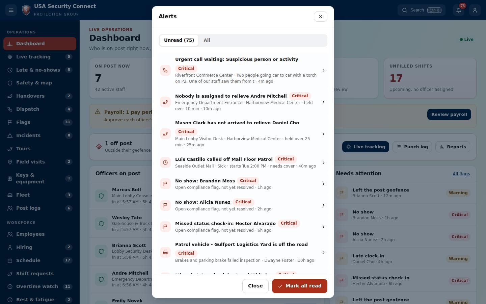</a><br><b>Alerts inbox</b><br>A bell with the unread count: duress, late starts and no-shows, missed check-ins, watchlist overrides, urgent issues, unhappy clients, skipped patrol checkpoints, client requests and lapsing licences, each one a click from where it is handled.</td>
  </tr>
  <tr>
    <td width="50%" valign="top"><a href="docs/screenshots/live.jpg">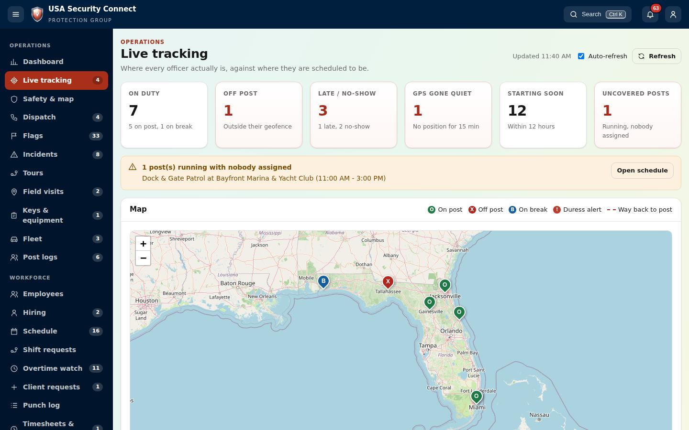</a><br><b>Live tracking</b><br>Every officer on duty on a map of Florida: off post, late, on break, GPS gone quiet, and posts with nobody assigned.</td>
    <td width="50%" valign="top"><a href="docs/screenshots/safety.jpg">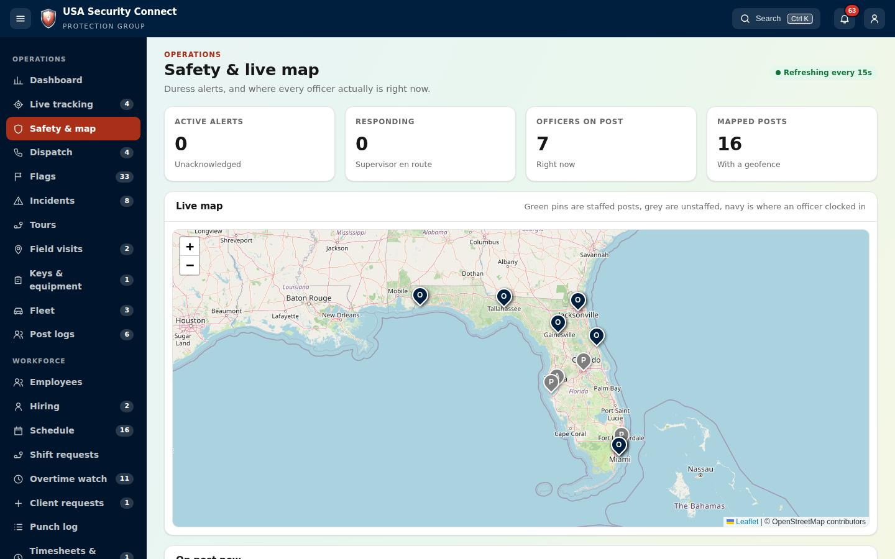</a><br><b>Safety &amp; map</b><br>Duress alerts, check-ins and every post's geofence on one map.</td>
  </tr>
  <tr>
    <td width="50%" valign="top"><a href="docs/screenshots/flags.jpg">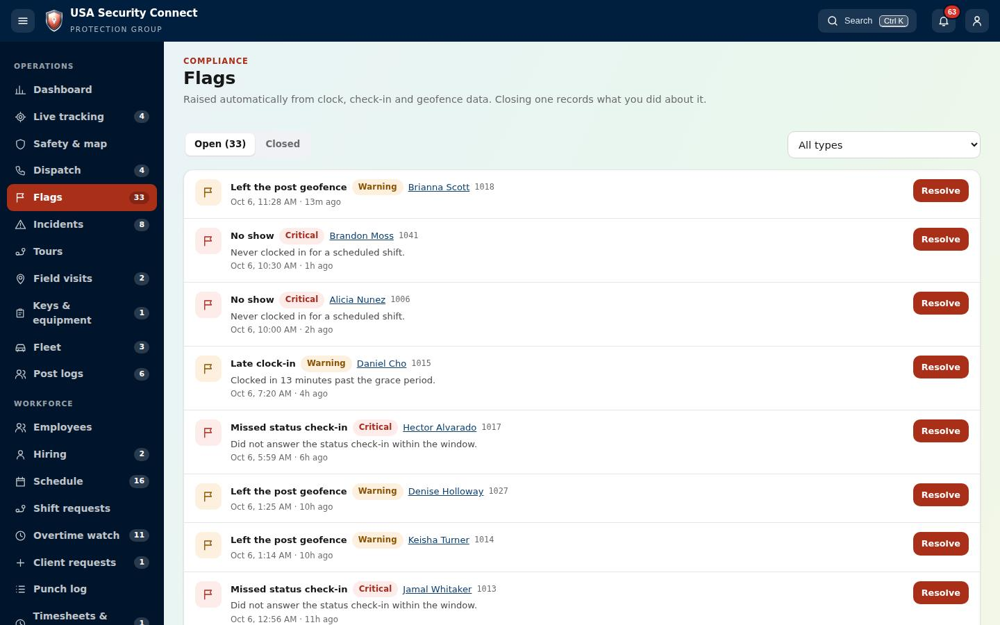</a><br><b>Flags</b><br>Late clock-ins, no-shows, walk-offs, missed check-ins and geofence violations, each closed with a note.</td>
    <td width="50%" valign="top"><a href="docs/screenshots/unconfirmed-shifts.jpg">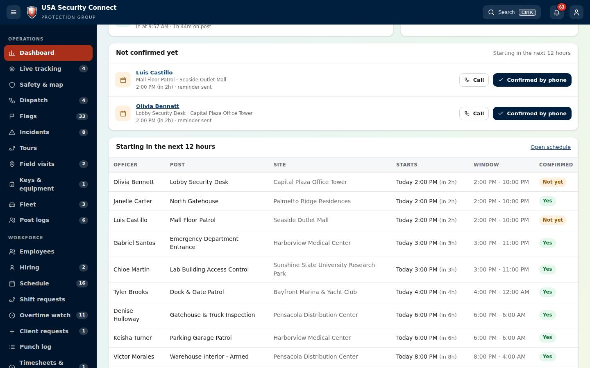</a><br><b>Not confirmed yet</b><br>Who is due on post in the next 12 hours and has not said they will be there, with the number to call. An answer taken on the phone is recorded in one click.</td>
  </tr>
  <tr>
    <td width="50%" valign="top"><a href="docs/screenshots/confirm-shift.jpg">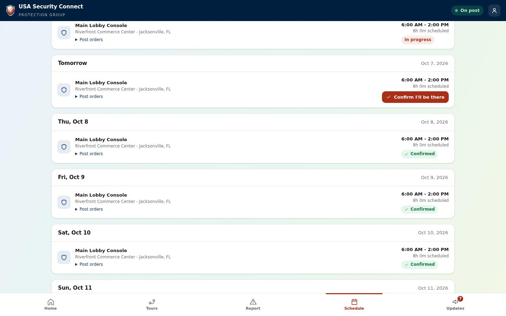</a><br><b>Confirm a shift</b><br>Officers confirm each shift in the week ahead, on the web or the app. A day out, anyone who has not gets one reminder. Moving the shift means confirming it again.</td>
    <td width="50%" valign="top"><a href="docs/screenshots/dispatch.jpg">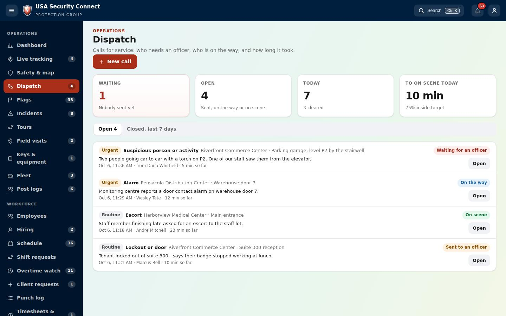</a><br><b>Dispatch</b><br>Every open call for service, waiting ones first: from the client or the office, who has it, and how long it has been going.</td>
  </tr>
  <tr>
    <td width="50%" valign="top"><a href="docs/screenshots/dispatch-call.jpg">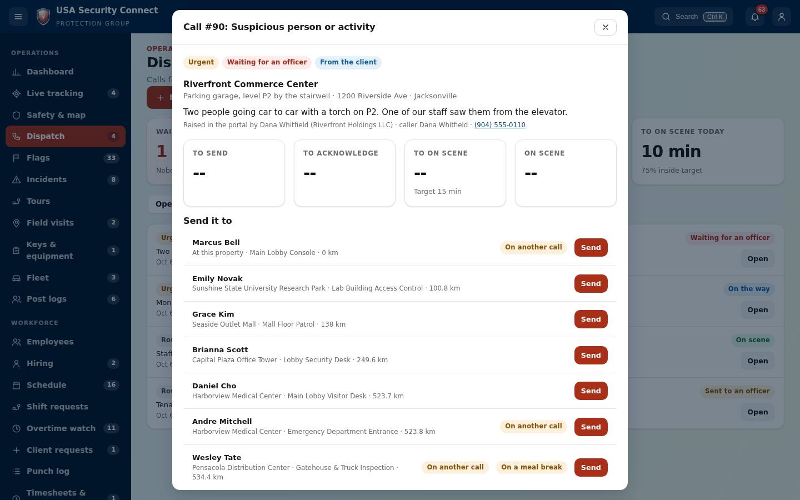</a><br><b>Send it to an officer</b><br>Everyone on duty, whoever is at the property first, then by distance; busy or on a break is marked. Every step is timed against the target and logged.</td>
    <td width="50%" valign="top"><a href="docs/screenshots/portal-calls.jpg">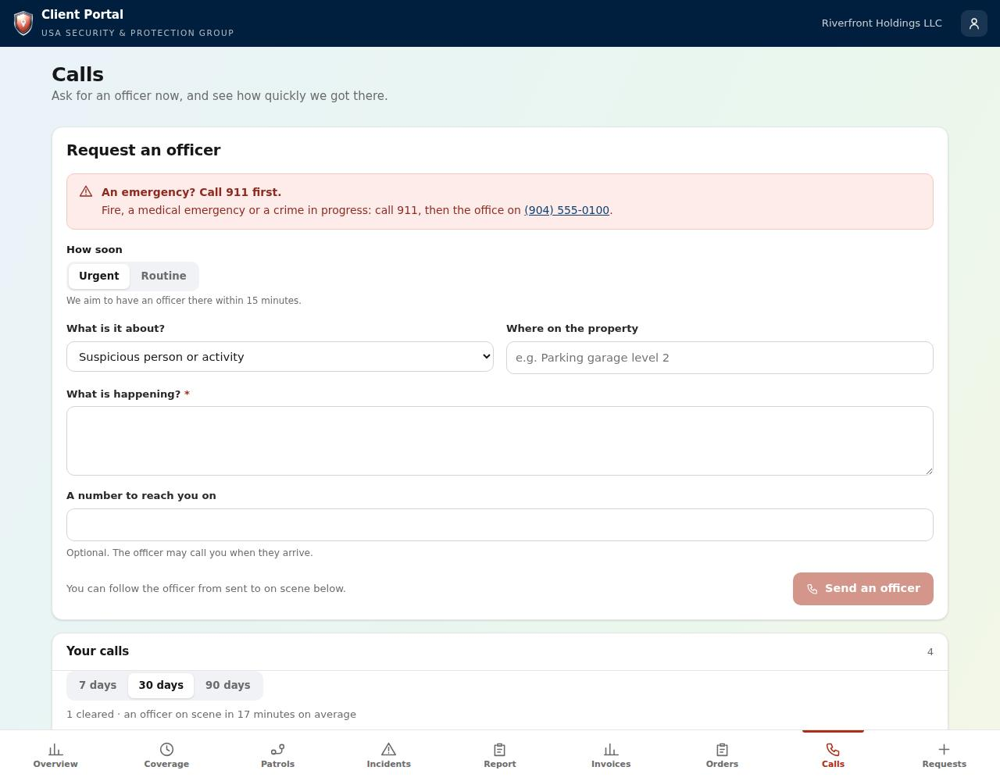</a><br><b>Clients request an officer</b><br>Urgent or routine from the portal (emergencies go to 911), followed from sent to on scene, with response times and an email when it is cleared.</td>
  </tr>
  <tr>
    <td width="50%" valign="top"><a href="docs/screenshots/fleet.jpg">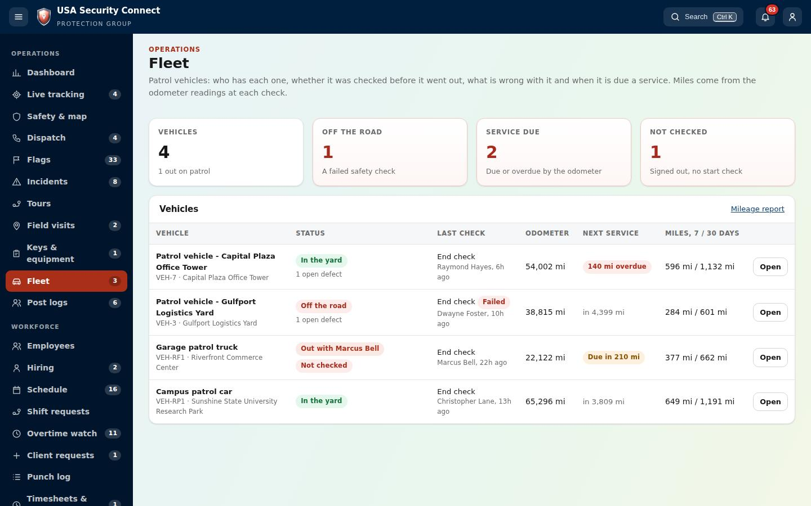</a><br><b>Fleet</b><br>Every patrol vehicle: who has it and whether they checked it, the odometer, the miles, and the next service by mileage. A failed brake check takes one off the road.</td>
    <td width="50%" valign="top"><a href="docs/screenshots/fleet-vehicle.jpg">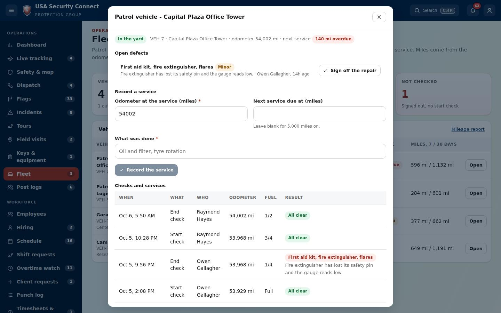</a><br><b>A vehicle's record</b><br>Open defects with a sign-off for the repair, a service form, and every check with its odometer, fuel and anything that failed.</td>
  </tr>
  <tr>
    <td width="50%" valign="top"><a href="docs/screenshots/handovers.jpg">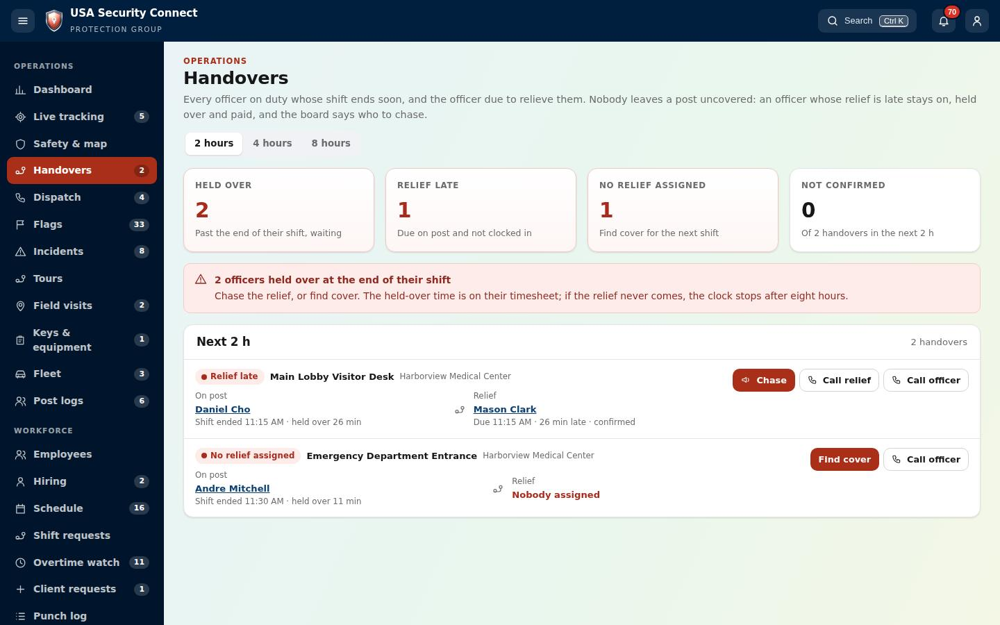</a><br><b>Handovers</b><br>Every officer whose shift ends in the next two hours and the officer due to relieve them: on post, confirmed, not confirmed, late, or nobody assigned. Officers held over come first.</td>
    <td width="50%" valign="top"><a href="docs/screenshots/handover-chase.jpg">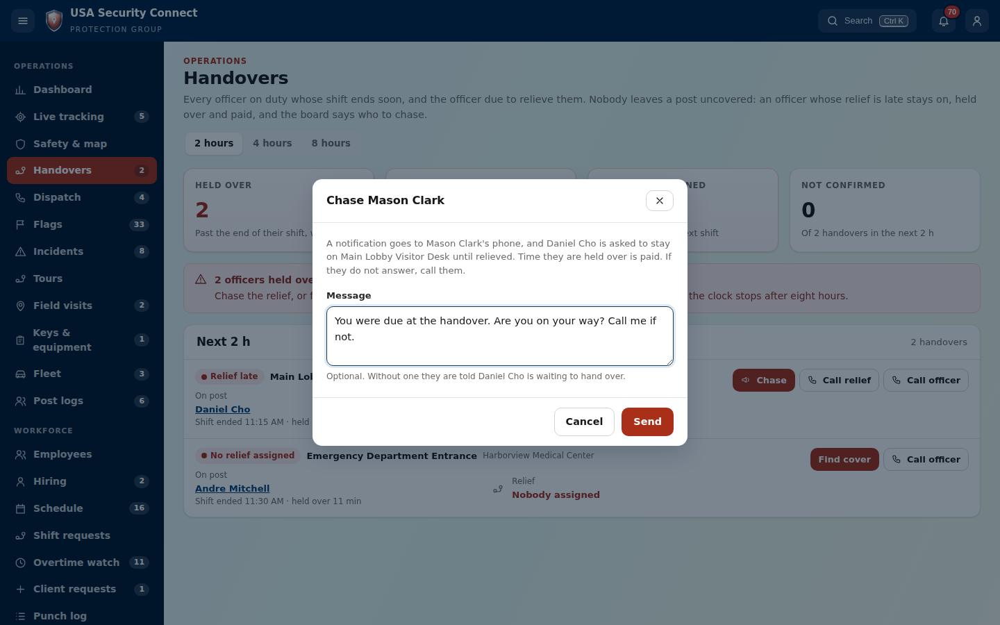</a><br><b>Chase the relief</b><br>A push to the late relief and one asking the officer on post to stay; or straight to the schedule to find cover when nobody is assigned.</td>
  </tr>
  <tr>
    <td width="50%" valign="top"><a href="docs/screenshots/attendance.jpg">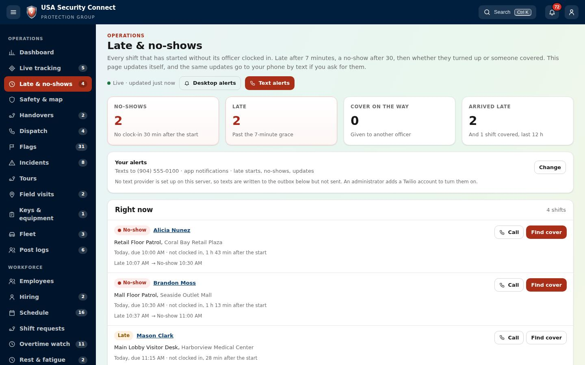</a><br><b>Late &amp; no-shows</b><br>Every shift that has started without its officer clocked in: late after 7 minutes, a no-show after 30, then whether they turned up or someone covered. The page updates itself, with a pop-up for each new one.</td>
    <td width="50%" valign="top"><a href="docs/screenshots/attendance-texts.jpg">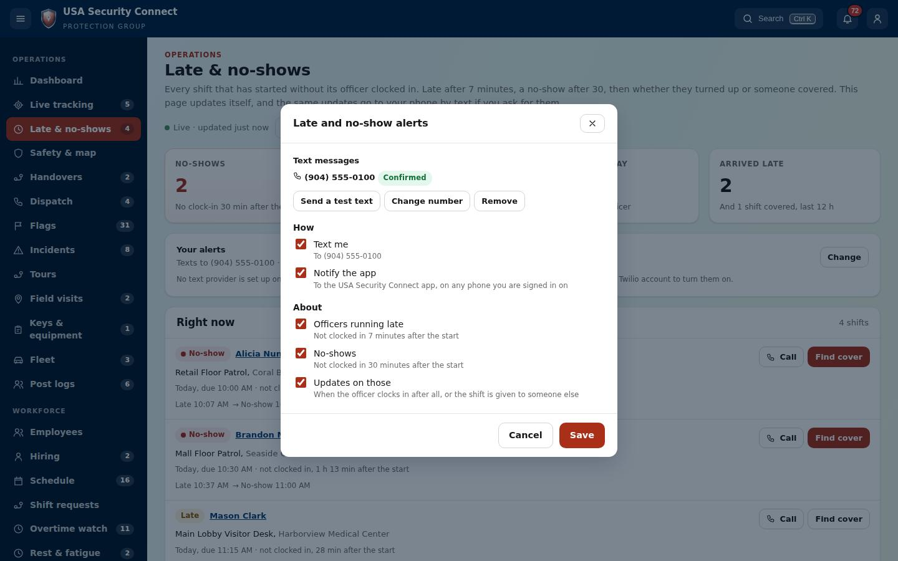</a><br><b>Text alerts</b><br>Each supervisor and administrator picks what they hear of, by text and app notification. Texts go only to a number confirmed with a code, and every one is kept in the outbox.</td>
  </tr>
  <tr>
    <td width="50%" valign="top"><a href="docs/screenshots/incidents.jpg">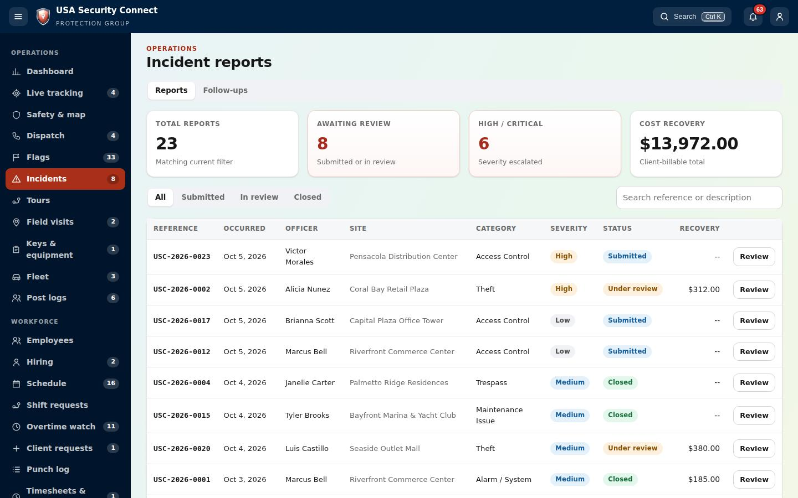</a><br><b>Incidents</b><br>Reports from the field with photos, severity, police numbers and review status.</td>
    <td width="50%" valign="top"><a href="docs/screenshots/follow-ups.jpg">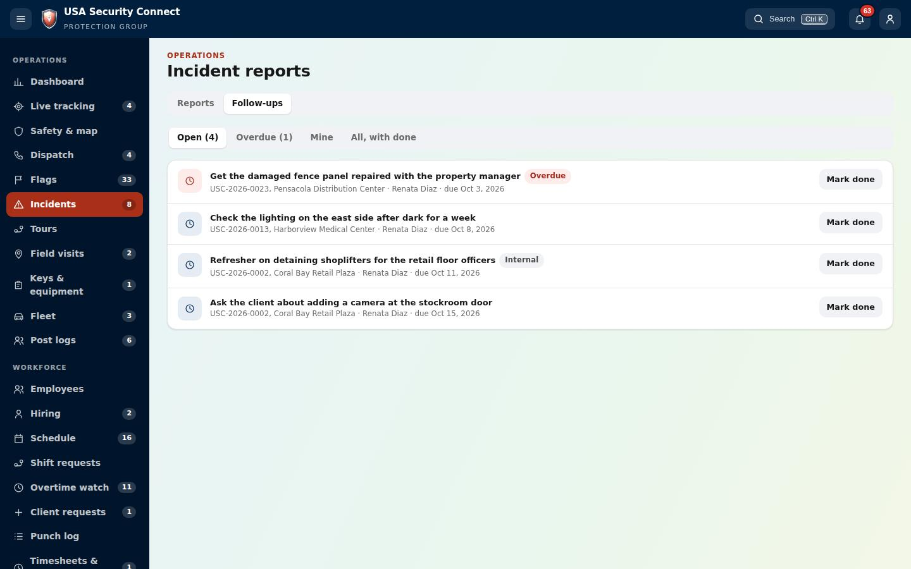</a><br><b>Incident follow-ups</b><br>What has to happen after a serious incident, each with an owner and a due date. Overdue ones land in the alerts inbox.</td>
  </tr>
  <tr>
    <td width="50%" valign="top"><a href="docs/screenshots/incident-followups.jpg">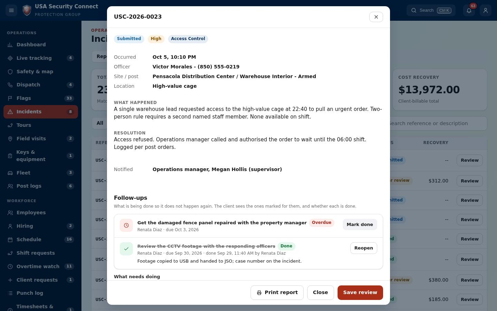</a><br><b>Follow-ups on the incident</b><br>Added from the review; marked done only with a note of what was done, and shared with the client or kept internal.</td>
    <td width="50%" valign="top"><a href="docs/screenshots/incident-print.jpg">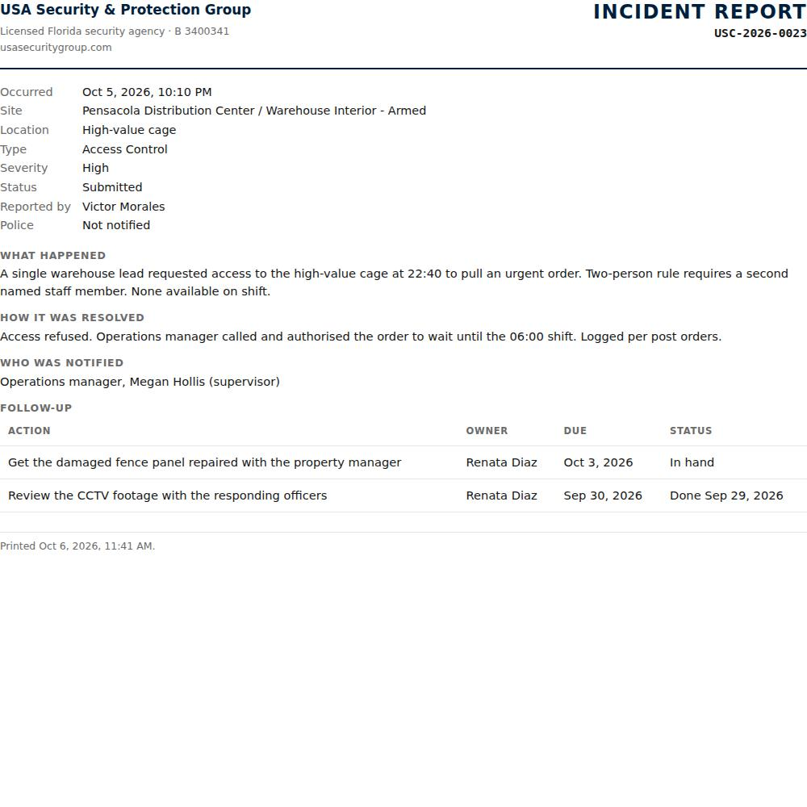</a><br><b>Printable incident report</b><br>One page for the insurer, the police or the client file. Review notes and internal follow-ups stay off it.</td>
  </tr>
  <tr>
    <td width="50%" valign="top"><a href="docs/screenshots/tours.jpg">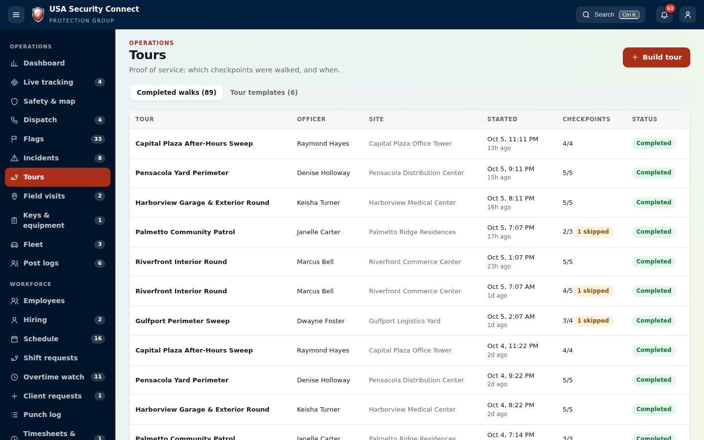</a><br><b>Tours</b><br>Checkpoint routes and every run: completed, missed and abandoned.</td>
    <td width="50%" valign="top"><a href="docs/screenshots/qr-tags.jpg">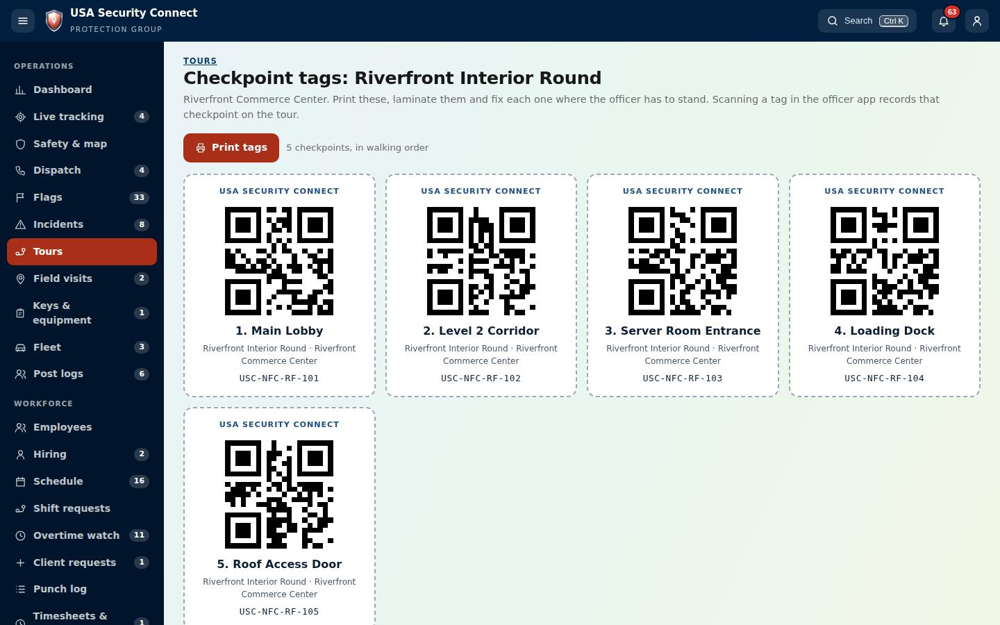</a><br><b>QR checkpoint tags</b><br>A printable tag for every checkpoint on a tour. Officers scan it with the phone camera to record the checkpoint.</td>
  </tr>
  <tr>
    <td width="50%" valign="top"><a href="docs/screenshots/field-visits.jpg">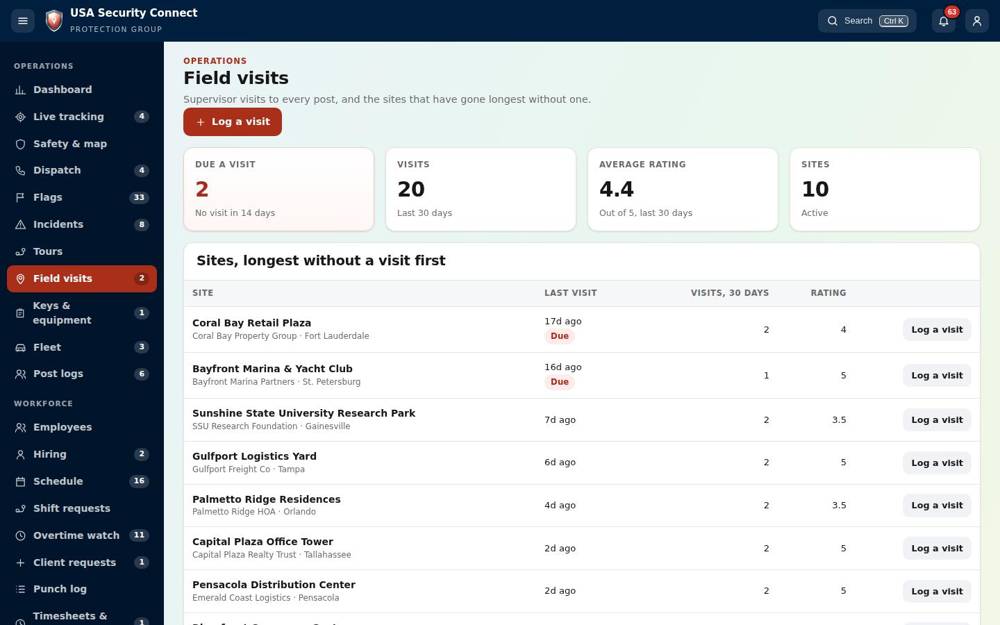</a><br><b>Field visits</b><br>Every site with its last supervisor visit, longest first. Two weeks without one and the site is due: a badge, an alert and a line on site health until someone goes.</td>
    <td width="50%" valign="top"><a href="docs/screenshots/field-visits-problems.jpg">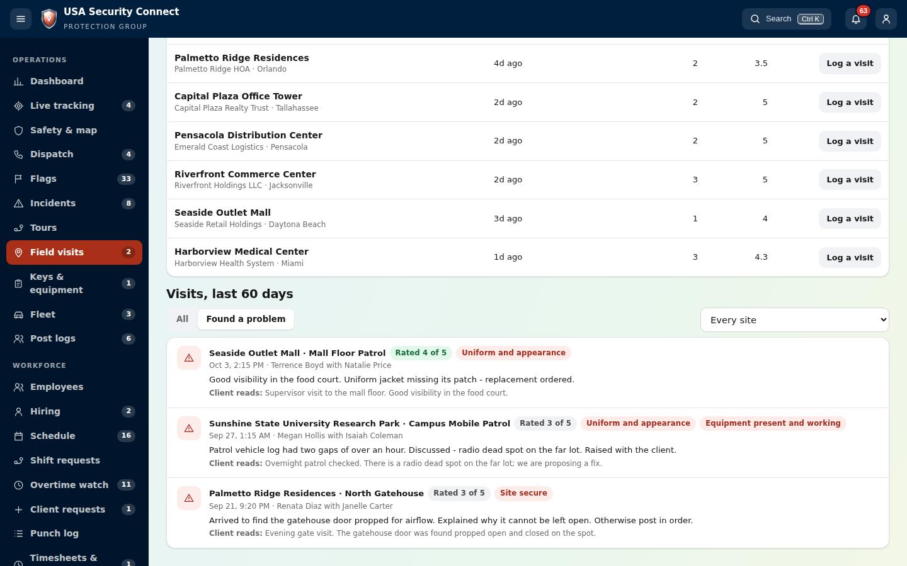</a><br><b>Visits that found a problem</b><br>Failed checks and low ratings, with the supervisor's own notes kept apart from the note the client reads.</td>
  </tr>
  <tr>
    <td width="50%" valign="top"><a href="docs/screenshots/equipment.jpg">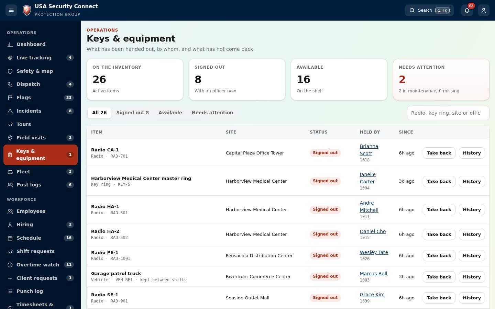</a><br><b>Keys &amp; equipment</b><br>Who holds which key ring, radio or firearm, and what should have come back by now.</td>
    <td width="50%" valign="top"><a href="docs/screenshots/search.jpg">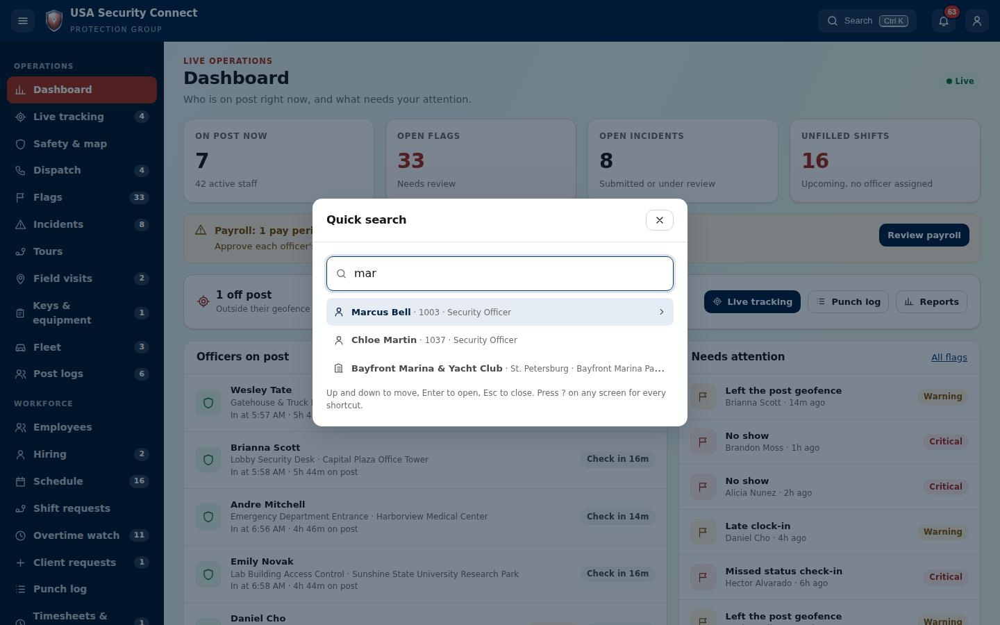</a><br><b>Quick search</b><br>Ctrl K from anywhere: officers by name, code or phone, sites, incident numbers and screens.</td>
  </tr>
  <tr>
    <td width="50%" valign="top"><a href="docs/screenshots/shortcuts.jpg">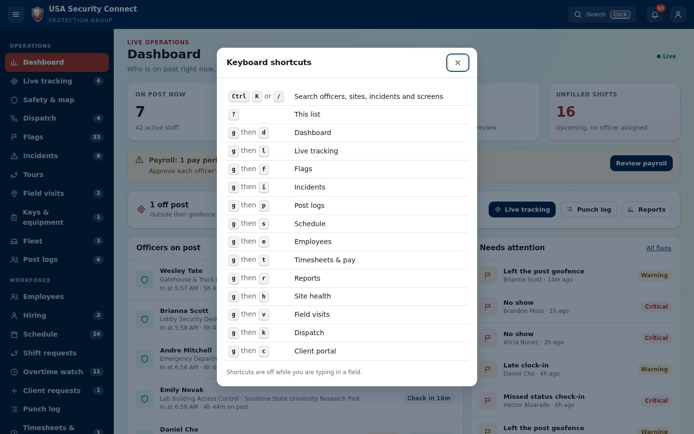</a><br><b>Keyboard shortcuts</b><br>Press ? for the list; g then a letter jumps to any main screen.</td>
    <td width="50%" valign="top"><a href="docs/screenshots/night-dashboard.jpg">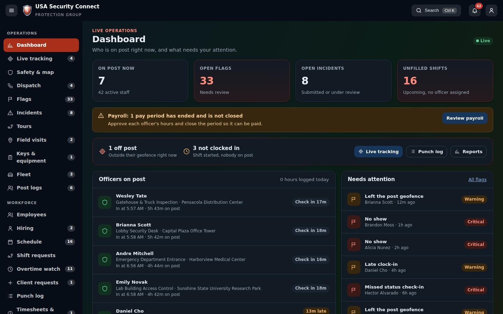</a><br><b>Night mode</b><br>Auto, Light or Night from the account menu. Auto follows the device, so night shifts get a dark screen on their own.</td>
  </tr>
</table>

On the phone:

<table>
  <tr>
    <td width="25%" valign="top"><a href="docs/screenshots/officer-call.jpg"></a><br><b>Calls on the officer's phone</b><br>On my way, on scene, clear with what was found, or turn it back with a reason. Clocking out hands an open call back to the office.</td>
    <td width="25%" valign="top"><a href="docs/screenshots/officer-vehicle-check.jpg">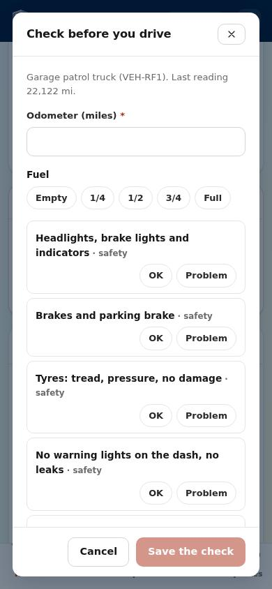</a><br><b>Check before driving</b><br>Odometer, fuel and nine items, every one answered. A failed safety item says &quot;do not drive&quot;. The end check gives the miles.</td>
    <td width="25%" valign="top"><a href="docs/screenshots/officer-visit.jpg">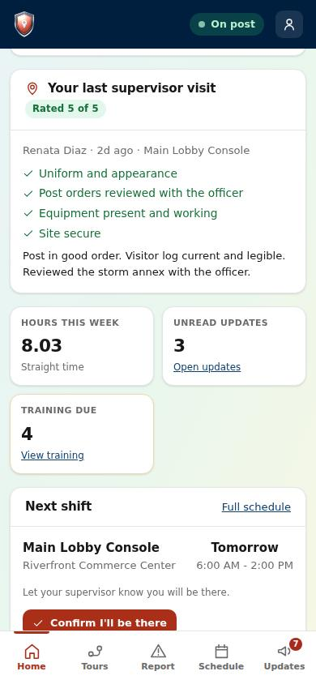</a><br><b>Your last supervisor visit</b><br>For a week after a visit, the officer sees who came, the rating, each check and what was said.</td>
    <td width="25%"></td>
  </tr>
</table>

### Post logs

Everything officers record on post, gathered across every site. *Admin and supervisor.*

<table>
  <tr>
    <td width="50%" valign="top"><a href="docs/screenshots/visitors.jpg">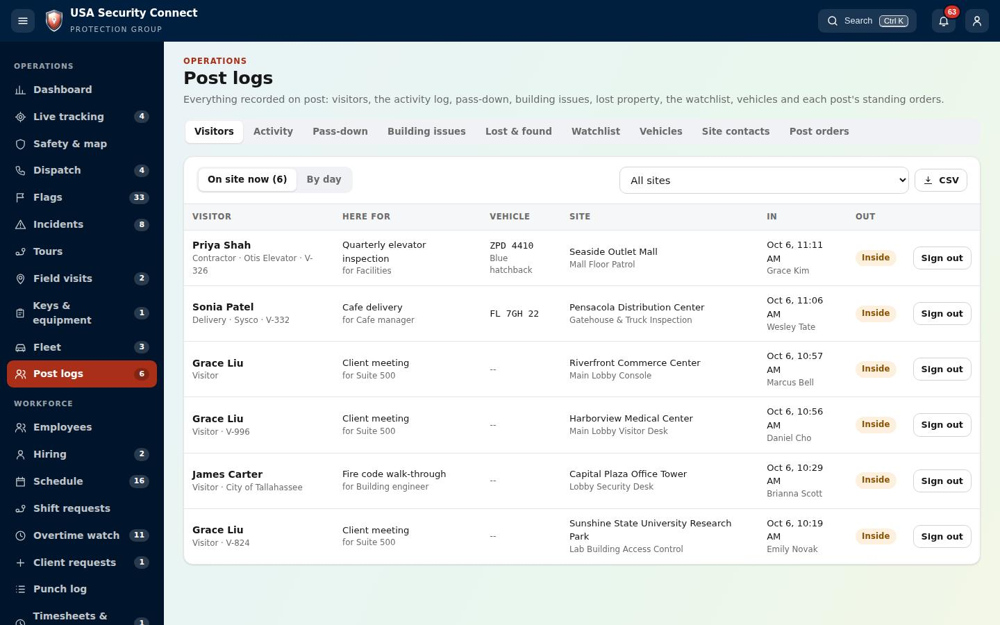</a><br><b>Visitors</b><br>Everyone signed in at every site right now, or any day's log, with vehicle and who let them in.</td>
    <td width="50%" valign="top"><a href="docs/screenshots/activity.jpg">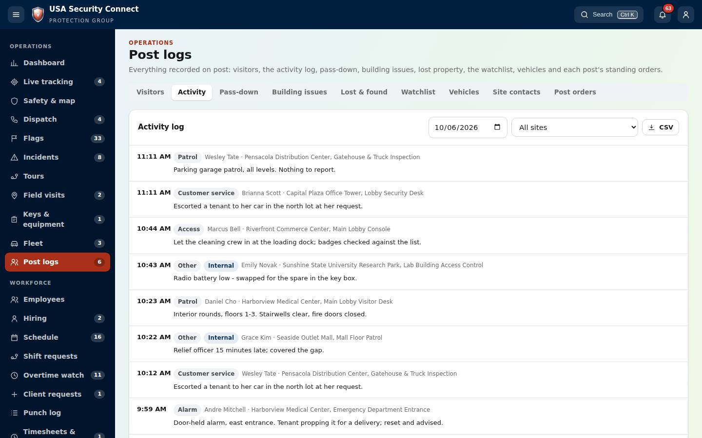</a><br><b>Activity log</b><br>The officers' running log: patrols, alarms, access and safety, with internal-only entries marked.</td>
  </tr>
  <tr>
    <td width="50%" valign="top"><a href="docs/screenshots/passdown.jpg">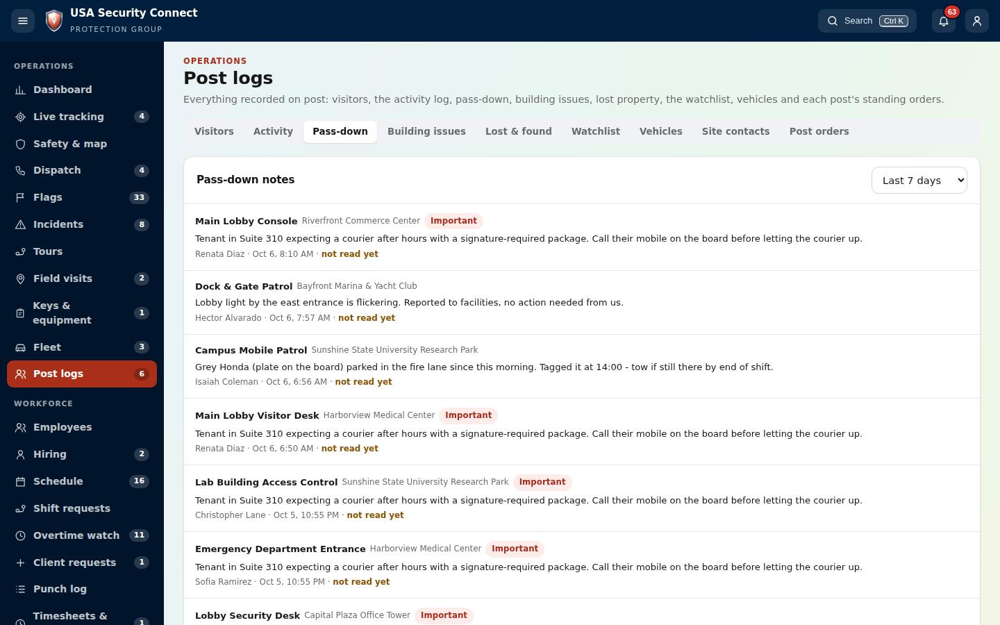</a><br><b>Pass-down</b><br>What each shift left for the next, and who has read it.</td>
    <td width="50%" valign="top"><a href="docs/screenshots/issues.jpg">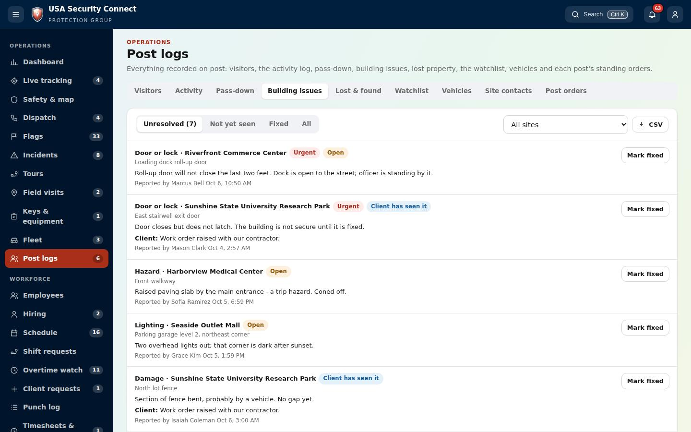</a><br><b>Building issues</b><br>Lights out, doors that will not lock, leaks and hazards, with the client's reply.</td>
  </tr>
  <tr>
    <td width="50%" valign="top"><a href="docs/screenshots/found.jpg">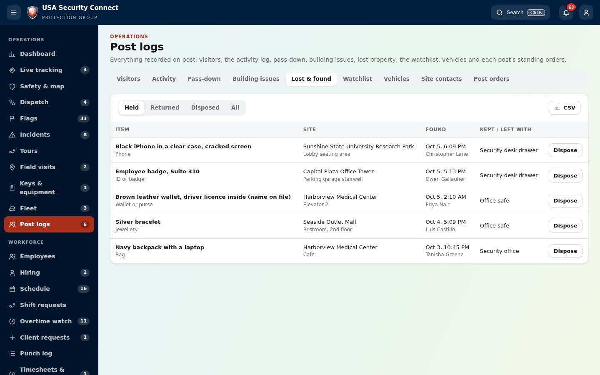</a><br><b>Lost &amp; found</b><br>Items held, returned with a name and ID, or disposed of, with anything over 30 days flagged.</td>
    <td width="50%" valign="top"><a href="docs/screenshots/watchlist.jpg">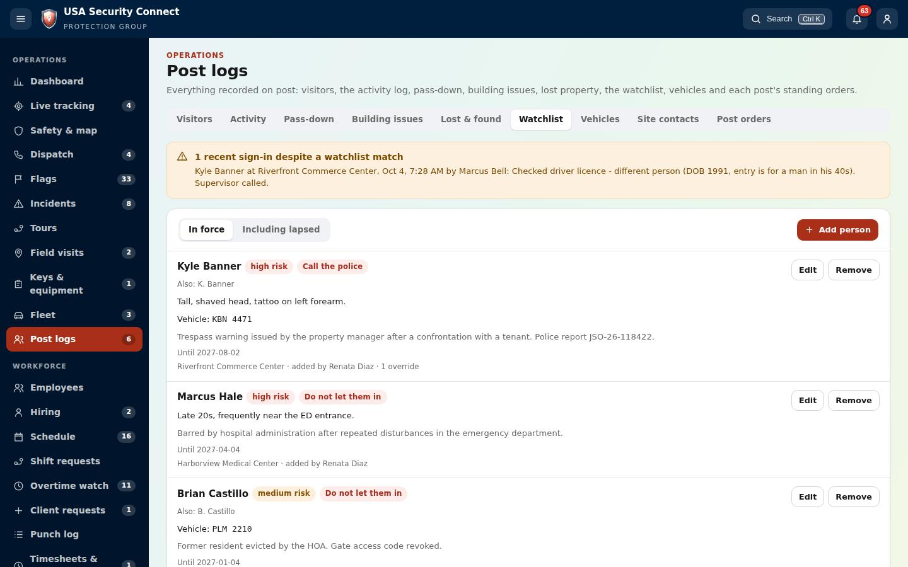</a><br><b>Watchlist</b><br>People not to be let in, by site or company-wide, and every sign-in that overrode a match.</td>
  </tr>
  <tr>
    <td width="50%" valign="top"><a href="docs/screenshots/vehicles.jpg">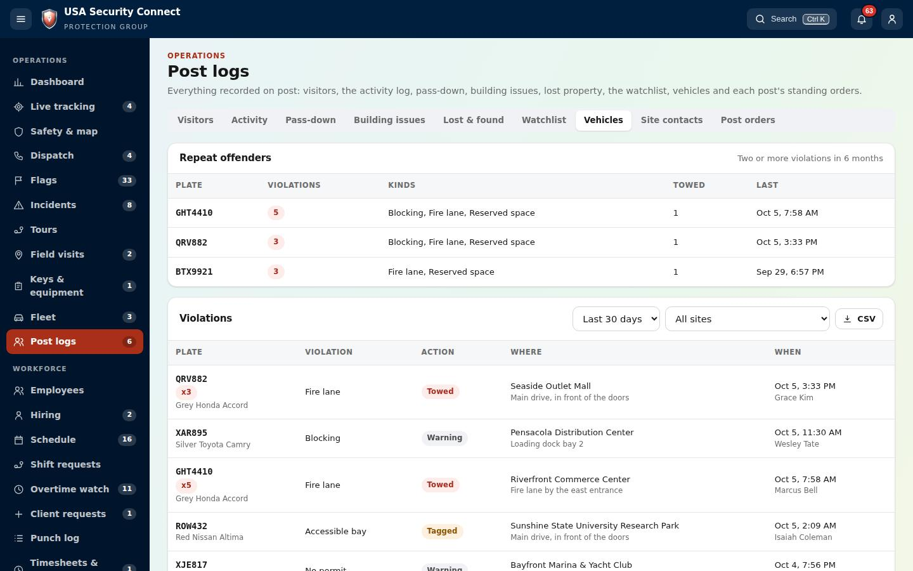</a><br><b>Vehicles</b><br>Parking enforcement by plate, with repeat offenders across every site.</td>
    <td width="50%" valign="top"><a href="docs/screenshots/contacts.jpg">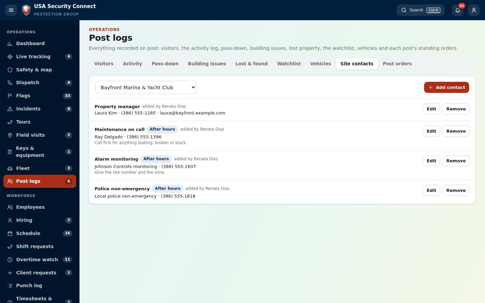</a><br><b>Site contacts</b><br>Who officers call at each site, kept by supervisors and by the client.</td>
  </tr>
  <tr>
    <td width="50%" valign="top"><a href="docs/screenshots/orders.jpg"></a><br><b>Post orders</b><br>Each post's standing orders, versioned. Issue a new version, see which officers have not read it yet, and answer clients' requested changes.</td>
    <td width="50%" valign="top"><a href="docs/screenshots/orders-apply.jpg">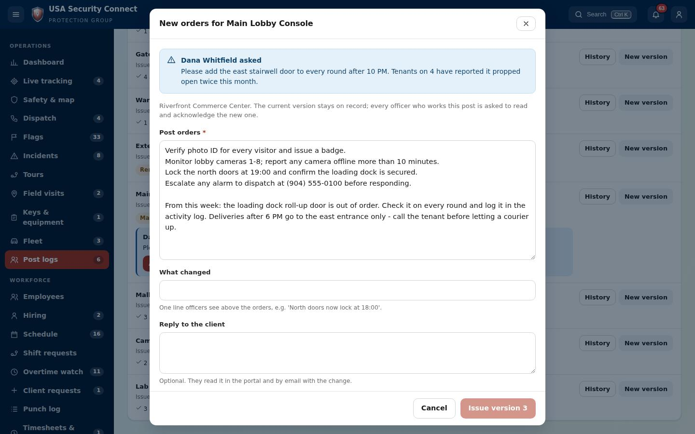</a><br><b>A client's change, applied</b><br>Apply a client's request as the next version, with a reply they get in the portal and by email. Or decline it with a reason.</td>
  </tr>
  <tr>
    <td width="50%" valign="top"><a href="docs/screenshots/dar.jpg">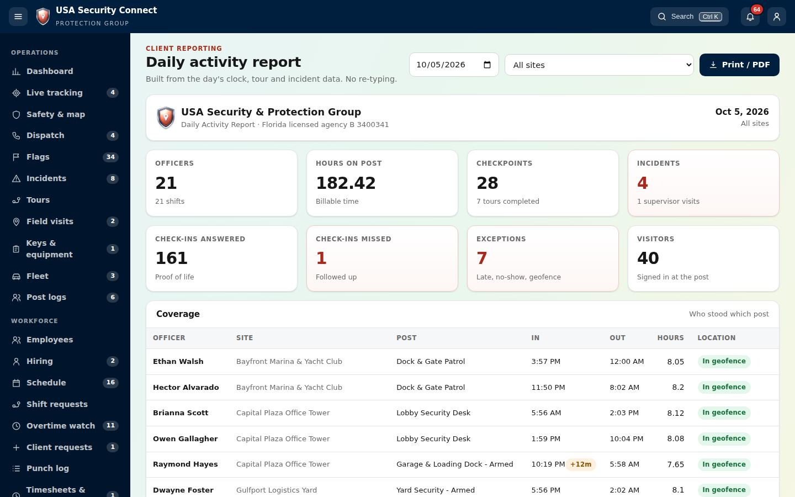</a><br><b>Daily activity report</b><br>The day's coverage, patrols, incidents, visitors, parking and activity log, ready to print.</td>
    <td width="50%"></td>
  </tr>
</table>

### Scheduling & people

Build rosters, answer requests, keep licences current.

<table>
  <tr>
    <td width="50%" valign="top"><a href="docs/screenshots/schedule.jpg"></a><br><b>Schedule</b><br>The week by post, open shifts, copy-week, and a candidate ranker that blocks anyone who cannot work a shift.</td>
    <td width="50%" valign="top"><a href="docs/screenshots/shift-requests.jpg">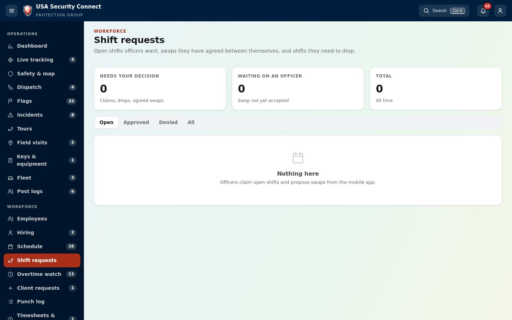</a><br><b>Shift requests</b><br>Open-shift claims, swaps and drops waiting for approval.</td>
  </tr>
  <tr>
    <td width="50%" valign="top"><a href="docs/screenshots/coverage-requests.jpg">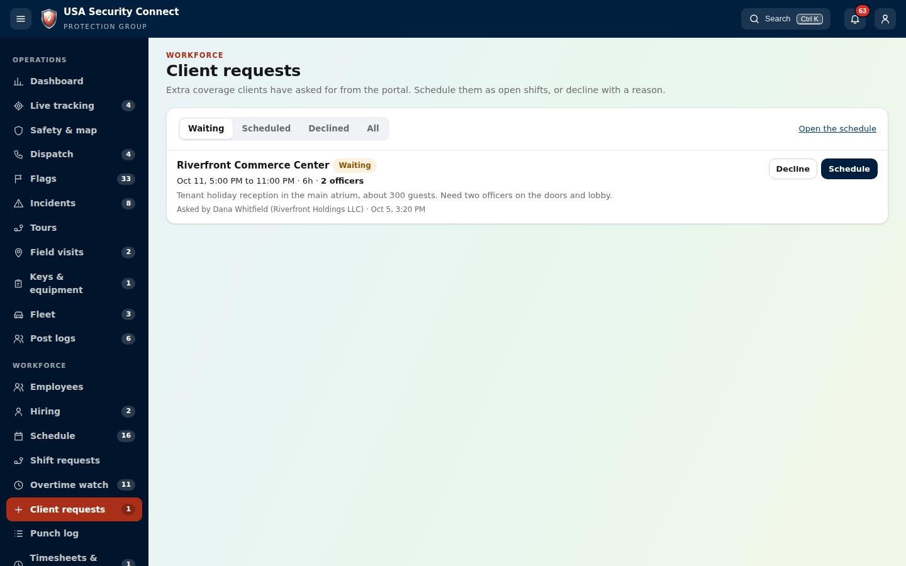</a><br><b>Client requests</b><br>Extra coverage clients asked for; schedule it as open shifts or decline with a reason.</td>
    <td width="50%" valign="top"><a href="docs/screenshots/service-agreements.jpg">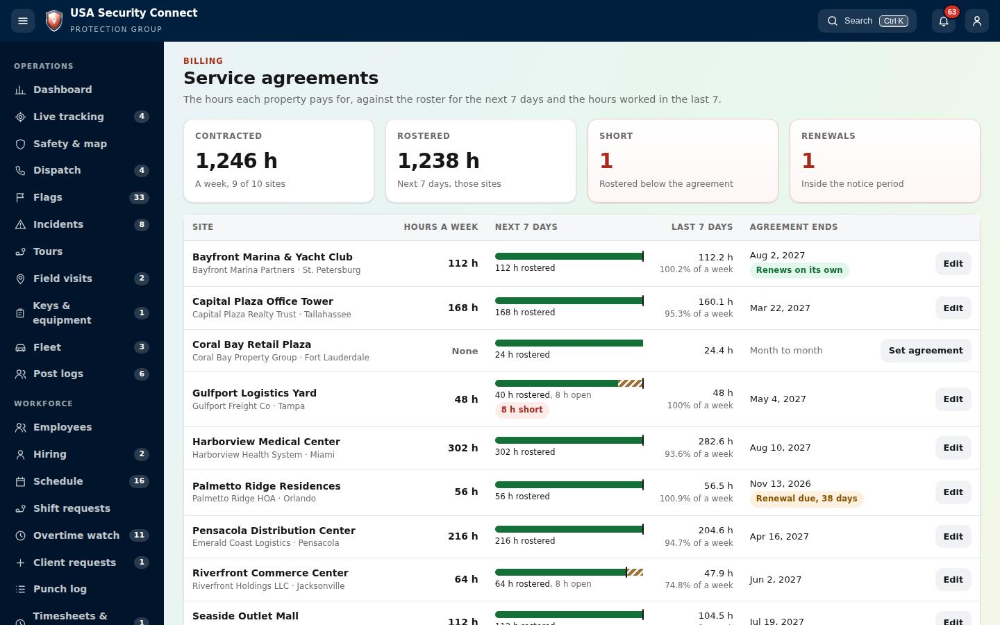</a><br><b>Service agreements</b><br>The hours each property pays for, against next week's roster and last week's hours worked. Short weeks and renewals coming up are flagged.</td>
  </tr>
  <tr>
    <td width="50%" valign="top"><a href="docs/screenshots/time-off.jpg">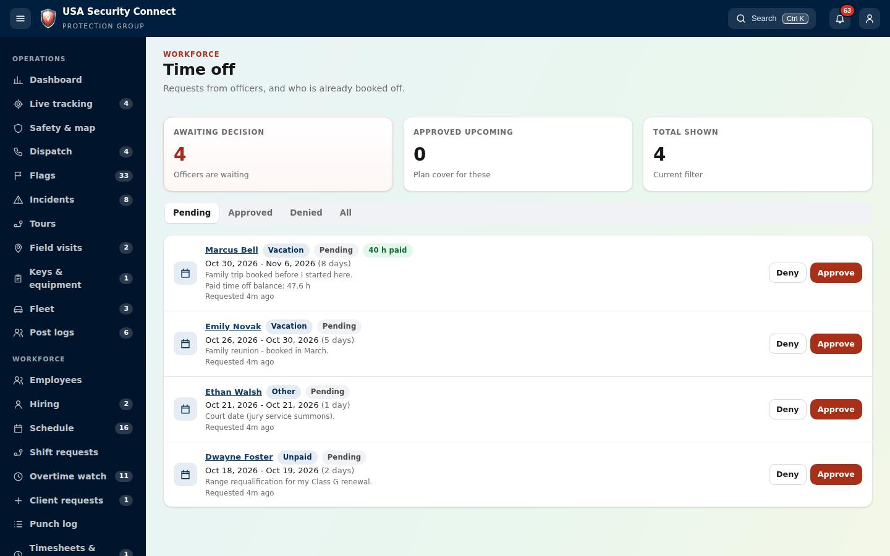</a><br><b>Time off</b><br>Requests to approve, with overlaps refused.</td>
    <td width="50%" valign="top"><a href="docs/screenshots/corrections.jpg">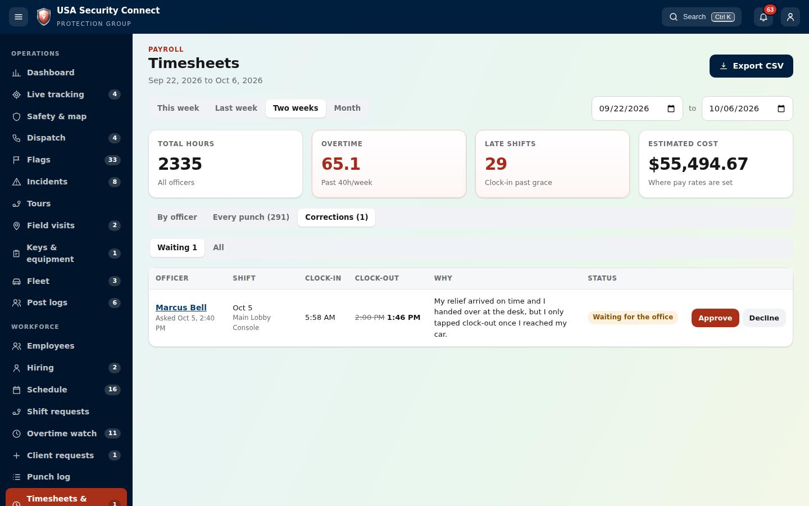</a><br><b>Time corrections</b><br>Every request with the time as recorded and as it should be, and why. A waiting request holds up closing that week's payroll.</td>
  </tr>
  <tr>
    <td width="50%" valign="top"><a href="docs/screenshots/correction-approve.jpg">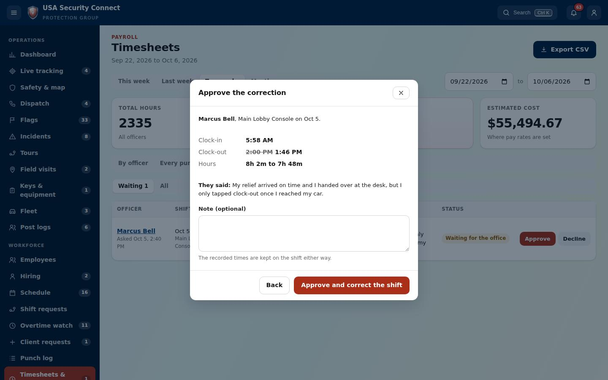</a><br><b>Approve or decline</b><br>An administrator approves (the shift is corrected, the recorded time kept) or declines with a reason the officer reads.</td>
    <td width="50%" valign="top"><a href="docs/screenshots/hiring-board.jpg">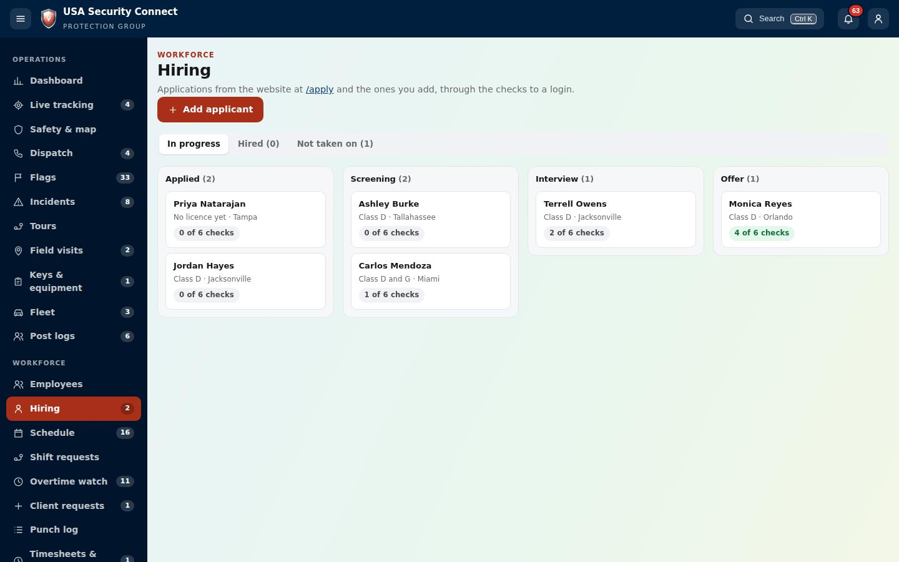</a><br><b>Hiring</b><br>Applications from the website and the office, stage by stage from applied to offer, with new ones in the alerts.</td>
  </tr>
  <tr>
    <td width="50%" valign="top"><a href="docs/screenshots/hiring-applicant.jpg"></a><br><b>Pre-hire checks</b><br>Licence, background check and right to work must be ticked before an administrator can hire; hiring creates the login and shows the code and PIN once.</td>
    <td width="50%" valign="top"><a href="docs/screenshots/apply.jpg"></a><br><b>Apply online</b><br>A public form at /apply, linked from the sign-in screen. No account needed; a confirmation email goes out.</td>
  </tr>
  <tr>
    <td width="50%" valign="top"><a href="docs/screenshots/employees.jpg"></a><br><b>Employees</b><br>All 43 staff with role, classification, licence and status.</td>
    <td width="50%" valign="top"><a href="docs/screenshots/employee.jpg"></a><br><b>Employee record</b><br>30-day hours, late arrivals, open flags, pay rate, paid time off, commendations, and every punch with its geofence check.</td>
  </tr>
  <tr>
    <td width="50%" valign="top"><a href="docs/screenshots/compliance.jpg"></a><br><b>Licensing</b><br>Class D and G licences and certificates, sorted by what expires first.</td>
    <td width="50%" valign="top"><a href="docs/screenshots/site-training.jpg"></a><br><b>Site training</b><br>Each post that needs it: who is trained, who has worked it and is waiting to be signed off, and who is on the roster there without training. Officers cannot claim or swap into those shifts.</td>
  </tr>
  <tr>
    <td width="50%" valign="top"><a href="docs/screenshots/site-training-signoff.jpg"></a><br><b>Sign an officer off</b><br>After a shadow shift, a walkthrough or past experience at the post. The officer's roster flags clear, and training lapses after 180 days away.</td>
    <td width="50%" valign="top"><a href="docs/screenshots/conduct.jpg"></a><br><b>Coaching &amp; discipline</b><br>Each step on an officer's record, from coaching to suspension: who stands where, what the officer has not signed yet, and the next step each would usually be.</td>
  </tr>
  <tr>
    <td width="50%" valign="top"><a href="docs/screenshots/conduct-issue.jpg"></a><br><b>Record a step</b><br>What happened and what is expected from now on. The step is suggested from their record this year; final warnings and suspensions are an administrator's.</td>
    <td width="50%" valign="top"><a href="docs/screenshots/employee-conduct.jpg"></a><br><b>On their record</b><br>Coached, a verbal warning signed with their side of it, a written warning they refused to sign, with the witness. Each counts for a year.</td>
  </tr>
  <tr>
    <td width="50%" valign="top"><a href="docs/screenshots/sites.jpg"></a><br><b>Sites &amp; posts</b><br>Ten client sites and their posts, the company's check-in interval, and the location check: every pin against its street address.</td>
    <td width="50%" valign="top"><a href="docs/screenshots/scorecards.jpg"></a><br><b>Scorecards</b><br>Every officer ranked out of 100 on punctuality, attendance, check-ins and flags.</td>
  </tr>
  <tr>
    <td width="50%" valign="top"><a href="docs/screenshots/location-check.jpg"></a><br><b>Location check</b><br>Every pin against its street address. A post pin dragged 924 m (3,032 ft) off is listed as wrong; <b>Use the address</b> puts it back on the building.</td>
    <td width="50%" valign="top"><a href="docs/screenshots/post-location.jpg"></a><br><b>A post's pin</b><br>Search the address, drag the pin, or stand at the post and set it from the phone, taken only with a fix good to 25 m (about 80 ft).</td>
  </tr>
  <tr>
    <td width="50%" valign="top"><a href="docs/screenshots/site-health.jpg"></a><br><b>Site health</b><br>Every property's month, worst first, scored out of 100 with the reasons: missed shifts, unscanned checkpoints, serious incidents, open issues, unhappy clients.</td>
    <td width="50%" valign="top"><a href="docs/screenshots/employee-attendance.jpg"></a><br><b>Attendance record</b><br>On each officer's record: how often on time, and every late arrival, no-show and call-off, with the reason, the notice given, who covered and the points it scores. Over the limit, it says so.</td>
  </tr>
  <tr>
    <td width="50%" valign="top"><a href="docs/screenshots/attendance-points-step.jpg"></a><br><b>Record a step</b><br>From the warning: a coaching on attendance, with the lapses already written out. Recording it clears the alert until the next lapse.</td>
    <td width="50%" valign="top"><a href="docs/screenshots/shift-offer.jpg"></a><br><b>Shift offers</b><br>Tick officers in the suggestions, or <b>Ask the top 3</b>, and send an open shift to them all at once. The first yes gets it, already confirmed; the dialog shows who was asked and what each said.</td>
  </tr>
</table>

On the phone:

<table>
  <tr>
    <td width="25%" valign="top"><a href="docs/screenshots/officer-punches.jpg"></a><br><b>Fix a time</b><br>An officer's punches from the last two weeks. A wrong one goes to the office with the right time and what happened; the answer shows here.</td>
    <td width="25%" valign="top"><a href="docs/screenshots/officer-licence.jpg"></a><br><b>Licence reminders</b><br>A licence or certificate lapsing within 30 days shows on the home screen.</td>
    <td width="25%" valign="top"><a href="docs/screenshots/officer-site-training.jpg"></a><br><b>Cleared for a post</b><br>Each post the officer is signed off at, by whom and how, and any training shift coming up.</td>
    <td width="25%" valign="top"><a href="docs/screenshots/officer-sign.jpg"></a><br><b>Read and sign</b><br>The officer reads what happened, adds their side if they want, and signs by typing their name. Signing says they read it, not that they agree.</td>
  </tr>
</table>

### Time & pay

Every punch, what it costs, and closing payroll. *Pay changes: admin only.*

<table>
  <tr>
    <td width="50%" valign="top"><a href="docs/screenshots/holidays.jpg"></a><br><b>Holidays</b><br>The company holiday calendar: what each one pays officers and bills clients, time and a half by default. Add the six usual ones in one step, or any federal holiday.</td>
    <td width="50%" valign="top"><a href="docs/screenshots/holidays-coming-up.jpg"></a><br><b>Holidays coming up</b><br>Each coming holiday with shifts booked, open and confirmed, the hours, and what the day adds in premium and billing. An open shift within two weeks goes in the alerts inbox.</td>
  </tr>
  <tr>
    <td width="50%" valign="top"><a href="docs/screenshots/holiday-register.jpg"></a><br><b>Holiday pay</b><br>Hours on a shift that starts on a holiday pay the premium to hourly W-2 officers, in its own column. Hours that are also overtime get the larger premium, not both.</td>
    <td width="50%" valign="top"><a href="docs/screenshots/holiday-schedule.jpg"></a><br><b>Holidays on the schedule</b><br>The roster marks the day, so whoever builds the week knows those shifts pay and bill more. Officers see it on their own schedule too.</td>
  </tr>
  <tr>
    <td width="50%" valign="top"><a href="docs/screenshots/overtime.jpg"></a><br><b>Overtime watch</b><br>Hours worked plus hours still rostered, for every hourly W-2 officer: who is going past 40, the premium it costs, and the shift that tips them over.</td>
    <td width="50%" valign="top"><a href="docs/screenshots/overtime-cover.jpg"></a><br><b>Find cover</b><br>Opens that shift on the schedule, with the overtime warning and the officers who could take it: those with hours to spare first, anyone over the attendance limit after them, and how often each was on time this month.</td>
  </tr>
  <tr>
    <td width="50%" valign="top"><a href="docs/screenshots/fatigue.jpg"></a><br><b>Rest &amp; fatigue</b><br>Shifts in the week ahead that leave an officer under 8 hours off, over 16 hours of work in a day, or past 6 days in a row, counted as worked: time held over at a handover counts.</td>
    <td width="50%" valign="top"><a href="docs/screenshots/fatigue-candidates.jpg"></a><br><b>When rostering</b><br>The officers offered for a shift carry the warning; a supervisor can still give it to them. An officer cannot claim or swap into one.</td>
  </tr>
  <tr>
    <td width="50%" valign="top"><a href="docs/screenshots/payroll.jpg"></a><br><b>Payroll</b><br>Weekly pay periods: last week waiting to close, the week before closed and frozen.</td>
    <td width="50%" valign="top"><a href="docs/screenshots/payroll-period.jpg"></a><br><b>Pay period review</b><br>Hours, regular, overtime and holiday pay per officer; a corrected punch shows as changed since approval.</td>
  </tr>
  <tr>
    <td width="50%" valign="top"><a href="docs/screenshots/time-off-pto.jpg"></a><br><b>Approve paid time off</b><br>The hours asked for against the balance they come from. Approving spends them, and is refused once they are gone.</td>
    <td width="50%" valign="top"><a href="docs/screenshots/employee-pto.jpg"></a><br><b>On the employee record</b><br>The statement, and an Adjust button for administrators: a carry-over, a payout, a mistake, always with a reason.</td>
  </tr>
  <tr>
    <td width="50%" valign="top"><a href="docs/screenshots/payroll-pto.jpg"></a><br><b>Paid with payroll</b><br>The next close pays it at the officer's rate on the day, beside the pay for hours worked, and credits what the week's hours earned.</td>
    <td width="50%" valign="top"><a href="docs/screenshots/expenses.jpg"></a><br><b>Expenses</b><br>What officers spent on the job and want back: parking, tolls, supplies, miles in their own car. An administrator approves or declines with a reason, never their own claim.</td>
  </tr>
  <tr>
    <td width="50%" valign="top"><a href="docs/screenshots/expense-receipt.jpg"></a><br><b>The receipt</b><br>Anything over $25 comes with a photo of the receipt, opened right from the claim. Only the officer and staff can see it.</td>
    <td width="50%" valign="top"><a href="docs/screenshots/payroll-expenses.jpg"></a><br><b>Paid with payroll</b><br>Approved claims are paid by the next close, apart from gross pay, and carried in the payroll register. A claim still waiting holds the close up.</td>
  </tr>
  <tr>
    <td width="50%" valign="top"><a href="docs/screenshots/employee-commendations.jpg"></a><br><b>On the officer's record</b><br>From clients and supervisors, with Commend to add one. Client thanks reach the alerts inbox, and the scorecards count them beside the score.</td>
    <td width="50%" valign="top"><a href="docs/screenshots/portal-commend.jpg"></a><br><b>Commend an officer</b><br>A client thanks an officer who worked their property lately, for something specific. The officer reads it word for word.</td>
  </tr>
  <tr>
    <td width="50%" valign="top"><a href="docs/screenshots/punches.jpg"></a><br><b>Punch log</b><br>Every clock-in and check-in with position, geofence verdict and distance from post.</td>
    <td width="50%" valign="top"><a href="docs/screenshots/timesheets.jpg"></a><br><b>Timesheets &amp; pay</b><br>Hours, weekly overtime, holiday hours, estimated pay, billing and margin, W-2 and 1099 apart.</td>
  </tr>
  <tr>
    <td width="50%" valign="top"><a href="docs/screenshots/pay-rates.jpg"></a><br><b>Pay rates</b><br>Classification, overtime and bill rate for everyone, with dated changes and bulk raises.</td>
    <td width="50%" valign="top"><a href="docs/screenshots/reports.jpg"></a><br><b>Reports</b><br>Fifteen reports over any range; here the payroll register, with W-9 status for 1099 contractors.</td>
  </tr>
  <tr>
    <td width="50%" valign="top"><a href="docs/screenshots/report-incidents.jpg"></a><br><b>Incident reports</b><br>Incidents by site, by type and by day: how serious, police called, still open, hours to close, and the worst week.</td>
    <td width="50%"></td>
  </tr>
</table>

On the phone:

<table>
  <tr>
    <td width="25%" valign="top"><a href="docs/screenshots/overtime-phone.jpg"></a><br><b>On a phone</b><br>A card per officer: the projection, the overtime and its cost, and the shift that tips it, with Find cover.</td>
    <td width="25%" valign="top"><a href="docs/screenshots/officer-pto.jpg"></a><br><b>Paid time off</b><br>Hourly W-2 staff earn an hour for every 30 worked, up to 80. The balance, what is asked for, what is free, and every hour earned, used or adjusted.</td>
    <td width="25%" valign="top"><a href="docs/screenshots/officer-request-time-off.jpg"></a><br><b>Ask for time off</b><br>On the web or the phone, paid from the balance or not. Never more than is free, at most 12 hours a day.</td>
    <td width="25%" valign="top"><a href="docs/screenshots/officer-claim-expense.jpg"></a><br><b>Claim an expense</b><br>From the profile or the phone app. Miles are priced at the IRS rate as they are typed; a receipt is a photo from the camera.</td>
  </tr>
  <tr>
    <td width="25%" valign="top"><a href="docs/screenshots/officer-expenses.jpg"></a><br><b>My expenses</b><br>What is waiting, approved and paid back, with the pay period that paid it, or why a claim was declined.</td>
    <td width="25%" valign="top"><a href="docs/screenshots/officer-commended.jpg"></a><br><b>You were commended</b><br>On the officer's home screen, web and phone, until read; every one stays on their profile.</td>
    <td width="25%" valign="top"><a href="docs/screenshots/officer-short-rest.jpg"></a><br><b>Short of rest</b><br>A shift on the officer's own schedule that leaves them short of rest, or past the hours or days, says so, web and phone.</td>
    <td width="25%" valign="top"><a href="docs/screenshots/officer-running-late.jpg"></a><br><b>Running late, or can't make it</b><br>Before the next shift, the officer tells the supervisors they are on their way and when they will arrive, or calls off and the shift opens for cover.</td>
  </tr>
  <tr>
    <td width="25%" valign="top"><a href="docs/screenshots/officer-my-attendance.jpg"></a><br><b>My attendance</b><br>The officer sees the same record their supervisors do, with their attendance points and how they are scored, on the profile and the phone's Worked tab.</td>
    <td width="25%" valign="top"><a href="docs/screenshots/officer-shift-offer.jpg"></a><br><b>Can you cover?</b><br>A shift a supervisor has asked about, on the home screen, web and phone: <b>Yes, I can</b> or <b>No</b> in one tap, and then how it went.</td>
    <td width="25%" valign="top"><a href="docs/screenshots/officer-check-in.jpg"></a><br><b>Check in</b><br>Between clock-in and clock-out the card says when the next check-in is; the button appears by itself when it is due, and where the officer is goes with it.</td>
    <td width="25%"></td>
  </tr>
</table>

### Billing & client quality

Invoices built from the hours payroll pays, and what clients think of the service.

<table>
  <tr>
    <td width="50%" valign="top"><a href="docs/screenshots/invoices.jpg"></a><br><b>Invoices</b><br>Drafts, sent, paid and overdue, with cost and margin kept on each. Holiday hours go on their own line naming the holiday.</td>
    <td width="50%" valign="top"><a href="docs/screenshots/invoice-questions.jpg"></a><br><b>Invoice questions</b><br>What clients ask about their invoices, waiting ones first, answered in place and emailed back.</td>
  </tr>
  <tr>
    <td width="50%" valign="top"><a href="docs/screenshots/signoff-board.jpg"></a><br><b>Client sign-off</b><br>Every property's last four weeks: signed off by the client, waiting, disputed, or changed since it was signed. A dispute waits in the alerts inbox until an administrator replies.</td>
    <td width="50%" valign="top"><a href="docs/screenshots/feedback.jpg"></a><br><b>Client feedback</b><br>Monthly ratings per property, the lowest first, with replies that go back to the client.</td>
  </tr>
  <tr>
    <td width="50%" valign="top"><a href="docs/screenshots/client-notices.jpg"></a><br><b>Notices to clients</b><br>A hurricane plan or holiday coverage, to every property or chosen ones, scheduled or now, optionally emailed, with who has read it.</td>
    <td width="50%" valign="top"><a href="docs/screenshots/clients.jpg"></a><br><b>Client portal logins</b><br>Contacts, the properties they can see, invitations and resets.</td>
  </tr>
</table>

### Communication & oversight

Notices to the force, required training, and the record of who changed what.

<table>
  <tr>
    <td width="50%" valign="top"><a href="docs/screenshots/broadcasts.jpg"></a><br><b>Broadcasts</b><br>Priority notices with read and acknowledge receipts per officer.</td>
    <td width="50%" valign="top"><a href="docs/screenshots/training.jpg"></a><br><b>Training</b><br>Required videos that cannot be marked done until they have been watched.</td>
  </tr>
  <tr>
    <td width="50%" valign="top"><a href="docs/screenshots/audit.jpg"></a><br><b>Audit log</b><br>Every sign-in, pay change, override and export, for administrators.</td>
    <td width="50%"></td>
  </tr>
</table>

### Officer app

What Marcus Bell sees on his phone at the Riverfront lobby console. *Officer.*

<table>
  <tr>
    <td width="25%" valign="top"><a href="docs/screenshots/officer-home.jpg"></a><br><b>Home</b><br>Check-in due, current post, geofence, slide to clock out.</td>
    <td width="25%" valign="top"><a href="docs/screenshots/officer-wrapup.jpg"></a><br><b>Before you go</b><br>Clocking out shows what the shift did and offers a pass-down note for the next officer.</td>
    <td width="25%" valign="top"><a href="docs/screenshots/night-officer.jpg"></a><br><b>At night</b><br>The same home screen, dark, for the 2 AM round.</td>
    <td width="25%" valign="top"><a href="docs/screenshots/officer-orders.jpg"></a><br><b>Post orders</b><br>Changed orders lead the home screen, with what changed, until the officer confirms they have read them.</td>
  </tr>
  <tr>
    <td width="25%" valign="top"><a href="docs/screenshots/officer-contacts.jpg"></a><br><b>Site contacts</b><br>Who to call at this site, a tap away.</td>
    <td width="25%" valign="top"><a href="docs/screenshots/officer-passdown.jpg"></a><br><b>Pass-down</b><br>Notes from the last shift, acknowledged one by one.</td>
    <td width="25%" valign="top"><a href="docs/screenshots/officer-activity.jpg"></a><br><b>Activity</b><br>Log a patrol or an alarm in two taps.</td>
    <td width="25%" valign="top"><a href="docs/screenshots/officer-visitors.jpg"></a><br><b>Visitors</b><br>Sign people in and out at the desk; a name on the watchlist is stopped.</td>
  </tr>
  <tr>
    <td width="25%" valign="top"><a href="docs/screenshots/officer-match.jpg"></a><br><b>Watchlist stop</b><br>A listed name is stopped with the instruction to follow.</td>
    <td width="25%" valign="top"><a href="docs/screenshots/officer-plate.jpg"></a><br><b>Plate lookup</b><br>Every violation for a plate, at any site.</td>
    <td width="25%" valign="top"><a href="docs/screenshots/officer-watchlist.jpg"></a><br><b>Watchlist</b><br>Who is not to be let in here.</td>
    <td width="25%" valign="top"><a href="docs/screenshots/officer-issues.jpg"></a><br><b>Building issues</b><br>Report what needs fixing; see the client's reply.</td>
  </tr>
  <tr>
    <td width="25%" valign="top"><a href="docs/screenshots/officer-found.jpg"></a><br><b>Lost &amp; found</b><br>Log an item and hand it back with ID.</td>
    <td width="25%" valign="top"><a href="docs/screenshots/officer-schedule.jpg"></a><br><b>Schedule</b><br>Upcoming shifts, holidays marked, Confirm I'll be there, and open shifts to claim.</td>
    <td width="25%" valign="top"><a href="docs/screenshots/officer-tours.jpg"></a><br><b>Tours</b><br>Patrol routes with checkpoints to scan.</td>
    <td width="25%" valign="top"><a href="docs/screenshots/officer-incident.jpg"></a><br><b>Report an incident</b><br>Category, severity, people, police and photos.</td>
  </tr>
  <tr>
    <td width="25%" valign="top"><a href="docs/screenshots/officer-updates.jpg"></a><br><b>Updates</b><br>Broadcasts, training and messages.</td>
    <td width="25%" valign="top"><a href="docs/screenshots/officer-profile.jpg"></a><br><b>Profile &amp; pay</b><br>Hours, this week's estimate, closed pay stubs, paid time off and expenses.</td>
    <td width="25%" valign="top"><a href="docs/screenshots/officer-held-over.jpg"></a><br><b>Held over</b><br>Past the end of the shift with the relief not here: who is coming, how late, and to stay on post, paid.</td>
    <td width="25%" valign="top"><a href="docs/screenshots/officer-relief.jpg"></a><br><b>Your relief duty</b><br>The relief sees whose post they take over, and when they are late, that someone is waiting.</td>
  </tr>
</table>

### Client portal

What a client sees for their own property, and nothing else: no pay, no staff records, no other clients. *Client.*

<table>
  <tr>
    <td width="50%" valign="top"><a href="docs/screenshots/portal.jpg"></a><br><b>Overview</b><br>Building issues to act on, who is on post now, and the week's coverage, patrols and incidents.</td>
    <td width="50%" valign="top"><a href="docs/screenshots/portal-notices.jpg"></a><br><b>Notices from us</b><br>At the top of every page until the contact marks each one read; urgent first.</td>
  </tr>
  <tr>
    <td width="50%" valign="top"><a href="docs/screenshots/portal-rate.jpg"></a><br><b>Rate us &amp; contacts</b><br>A monthly rating, our reply, and the contacts the officers call.</td>
    <td width="50%" valign="top"><a href="docs/screenshots/portal-report.jpg"></a><br><b>Daily report</b><br>Coverage, patrols, incidents, the activity log, visitors and parking for any day.</td>
  </tr>
  <tr>
    <td width="50%" valign="top"><a href="docs/screenshots/portal-coverage.jpg"></a><br><b>Coverage</b><br>Every scheduled shift, who stood it and when they clocked in and out.</td>
    <td width="50%" valign="top"><a href="docs/screenshots/portal-coming-up.jpg"></a><br><b>Coming up</b><br>The next 7 or 14 days, day by day: who is booked on each post and what is still being arranged.</td>
  </tr>
  <tr>
    <td width="50%" valign="top"><a href="docs/screenshots/portal-patrols.jpg"></a><br><b>Patrols</b><br>Each round walked, checkpoint by checkpoint.</td>
    <td width="50%" valign="top"><a href="docs/screenshots/portal-incidents.jpg"></a><br><b>Incidents</b><br>Full reports with photographs.</td>
  </tr>
  <tr>
    <td width="50%" valign="top"><a href="docs/screenshots/portal-followups.jpg"></a><br><b>What we are doing about it</b><br>On each incident, the follow-ups we share: in hand with a due date, or done. Who owns them and our notes stay with us.</td>
    <td width="50%" valign="top"><a href="docs/screenshots/portal-signoff.jpg"></a><br><b>Sign off the hours</b><br>Each finished week, post by post: the same clocked hours the invoice is built from, without a rate. Sign it off, or say what looks wrong.</td>
  </tr>
  <tr>
    <td width="50%" valign="top"><a href="docs/screenshots/portal-signoff-query.jpg"></a><br><b>Something looks wrong</b><br>A client queries a week with a reason; our reply comes back in the portal and by email, and the week is signed off once it looks right.</td>
    <td width="50%" valign="top"><a href="docs/screenshots/portal-invoices.jpg"></a><br><b>Invoices</b><br>Their own invoices, never pay rates or margin.</td>
  </tr>
  <tr>
    <td width="50%" valign="top"><a href="docs/screenshots/portal-invoice-question.jpg"></a><br><b>Ask about an invoice</b><br>About the whole invoice or one line; the answer arrives here and by email.</td>
    <td width="50%" valign="top"><a href="docs/screenshots/portal-requests.jpg"></a><br><b>Requests</b><br>Ask for extra officers and see the answer.</td>
  </tr>
  <tr>
    <td width="50%" valign="top"><a href="docs/screenshots/portal-orders.jpg"></a><br><b>Post orders</b><br>The orders our officers work to at each post, and a way to ask for a change.</td>
    <td width="50%" valign="top"><a href="docs/screenshots/portal-orders-training.jpg"></a><br><b>Trained officers only</b><br>A post that needs site training says how many of our officers are trained there, and when a shift that week is a training shift.</td>
  </tr>
  <tr>
    <td width="50%" valign="top"><a href="docs/screenshots/portal-monthly.jpg"></a><br><b>Monthly report</b><br>One property's month on a page: coverage by post, patrols, incidents, visitors and issues. Ready to print.</td>
    <td width="50%" valign="top"><a href="docs/screenshots/portal-emails.jpg"></a><br><b>Email me</b><br>Serious incident alerts as they happen, and a daily report each morning, if they want it.</td>
  </tr>
</table>

On the phone:

<table>
  <tr>
    <td width="25%" valign="top"><a href="docs/screenshots/portal-agreement-hours.jpg"></a><br><b>Hours against the agreement</b><br>Clients see the hours worked each week against what they pay for, and what is rostered next.</td>
    <td width="25%" valign="top"><a href="docs/screenshots/portal-confirmed.jpg"></a><br><b>Confirmed, for the client</b><br>Clients see which of the coming shifts the officer has confirmed.</td>
    <td width="25%" valign="top"><a href="docs/screenshots/holiday-rates-phone.jpg"></a><br><b>Holiday rates for clients</b><br>Clients see the holidays ahead and what each bills at, never what officers are paid. Holiday hours are invoiced on their own line naming the holiday.</td>
    <td width="25%"></td>
  </tr>
</table>

---

## Run it locally

```bash
npm install
npm run seed      # demo sites, posts, officers, shifts, incidents, tours
npm run dev       # API on :4000, web app on :5173
```

You need Node 22.5 or later (CI uses 22). There is no database to install: without
`DATABASE_URL` the API runs Postgres in-process with PGlite (see
[How it is built](#how-it-is-built)).

### Demo accounts

Open <http://localhost:5173> and sign in with a demo code + PIN:

| Code | PIN | Who | Notes |
|------|-----|-----|-------|
| `1001` | `2468` | Vince Ortega | Administrator — W-2 salaried, exempt |
| `1002` | `3571` | Renata Diaz | Field supervisor — W-2 hourly |
| `1003` | `4812` | Marcus Bell | Officer, **currently on post** |
| `1004` | `5930` | Janelle Carter | Officer — licence expiring soon |
| `1005` | `6174` | Dwayne Foster | **1099 contractor**, armed post |
| `1006` | `7285` | Alicia Nunez | Officer — W-2 hourly |
| `1007` | `8140` | Kevin Osei | New hire — forced to change PIN at first sign-in |
| `1008` | `9351` | Renee Okafor | **1099 contractor**, paid per shift |

Around those eight, the seed builds a regional operation: **ten client sites** from
Pensacola to Miami, **43 staff** (35 W-2 and 8 1099 contractors; 5 hold a Class G
armed licence), a month of rosters, 6,000+ GPS points, and a live "right now" whatever hour you seed it - officers
on post, one who has walked off it, one on a meal break, one whose phone has gone
quiet, one running late and one who never turned up. Every one of them can sign in:

<details>
<summary>All 35 regional accounts, 1009-1043</summary>

| Code | PIN | Who | Notes |
|------|-----|-----|-------|
| `1009` | `8271` | Terrence Boyd | Supervisor, W-2, Miami |
| `1010` | `7190` | Megan Hollis | Supervisor, W-2, armed, Tallahassee |
| `1011` | `6109` | Andre Mitchell | Officer, W-2, Miami |
| `1012` | `5028` | Sofia Ramirez | Officer, W-2, Miami |
| `1013` | `3947` | Jamal Whitaker | Officer, W-2, Hialeah |
| `1014` | `2866` | Keisha Turner | Officer, W-2, Miami |
| `1015` | `1785` | Daniel Cho | Officer, W-2, Miami |
| `1016` | `9704` | Tyler Brooks | Officer, W-2, St. Petersburg |
| `1017` | `8623` | Hector Alvarado | Officer, **1099**, St. Petersburg |
| `1018` | `7542` | Brianna Scott | Officer, W-2, Tallahassee |
| `1019` | `6461` | Owen Gallagher | Officer, W-2, Tallahassee |
| `1020` | `5380` | Raymond Hayes | Officer, **1099**, armed, Tallahassee |
| `1021` | `4299` | Emily Novak | Officer, W-2, Gainesville |
| `1022` | `3218` | Christopher Lane | Officer, W-2, Gainesville |
| `1023` | `2137` | Isaiah Coleman | Officer, W-2, Gainesville |
| `1024` | `1056` | Natalie Price | Officer, W-2, Daytona Beach |
| `1025` | `8975` | Luis Castillo | Officer, **1099**, Daytona Beach |
| `1026` | `7894` | Wesley Tate | Officer, W-2, Pensacola |
| `1027` | `6813` | Denise Holloway | Officer, W-2, Pensacola |
| `1028` | `5732` | Victor Morales | Officer, **1099**, armed, Pensacola |
| `1029` | `4651` | Tanisha Greene | Officer, W-2, Miami |
| `1030` | `3570` | Cody Fletcher | Officer, W-2, Pensacola |
| `1031` | `2489` | Jasmine Reed | Officer, W-2, Pensacola |
| `1032` | `1408` | Gabriel Santos | Officer, W-2, Miami |
| `1033` | `9327` | Priya Nair | Officer, W-2, Coral Gables |
| `1034` | `8246` | Ethan Walsh | Officer, W-2, St. Petersburg |
| `1035` | `7165` | Olivia Bennett | Officer, W-2, Tallahassee |
| `1036` | `6084` | Darnell Hughes | Officer, **1099**, armed, Tallahassee |
| `1037` | `5003` | Chloe Martin | Officer, W-2, Gainesville |
| `1038` | `3922` | Mason Clark | Officer, W-2, Gainesville |
| `1039` | `2841` | Grace Kim | Officer, W-2, Ormond Beach |
| `1040` | `1760` | Jordan Ellis | Officer, W-2, Gainesville |
| `1041` | `9679` | Brandon Moss | Officer, **1099**, Daytona Beach |
| `1042` | `8598` | Alexis Rivera | Officer, W-2, Tallahassee |
| `1043` | `7517` | Samuel Ortiz | Officer, W-2, Pensacola — **on leave, cannot sign in (by design)** |

</details>

Samuel Ortiz (`1043`) is deliberately on leave, to show what an inactive account
looks like: he is refused at sign-in with a message saying so, until a supervisor
sets him back to active under Employees. Every other code above signs in.

`npm run seed` prints every code and PIN, and who is on duty at that moment.

> These fixed PINs exist only in the demo seed. Real accounts get a random PIN
> generated in the admin console and shown exactly once.

### Three staff tiers, and a client

The three accounts at the top of that table are one of each kind. They do not
merely see more or less of the same screen — they get different applications.

| | Officer `1003` | Supervisor `1002` | Administrator `1001` |
|---|---|---|---|
| **Lands on** | Their own shift | The live operations dashboard | The live operations dashboard |
| **Navigation** | 5 tabs | 37 destinations | 38 destinations |
| **Can do** | Clock in/out, check in, walk tours, file incidents, claim shifts, request time off | All of that, plus run the shift: live GPS tracking, the punch log, review flags and incidents, approve time off and swaps, build and copy rosters, read timesheets, pay rates and every report | All of that, plus change the record: create staff, reset PINs, adjust time entries, set up sites and posts |
| **Money** | — | Reads invoices, pay rates and margin | Sets pay rates (single or bulk, effective-dated); approves and closes payroll periods; raises, issues and voids invoices; manages client portal logins |
| **Audit log** | — | — | Yes: the 38th destination |

A supervisor is a working officer too — they still have their own time clock.

The boundaries are enforced in the API, not just hidden in the UI:
`apps/server/test/roles.mjs` checks each one from both sides, so a control that
gets hidden but not gated will fail the suite.

A **client contact** is not a staff account at all. Separate sign-in, separate
token, 9 tabs, and no path to any of the above.

The client portal is at <http://localhost:5173/portal>, with its own sign-in:

| Email | Password | Property |
|-------|----------|----------|
| `dana.whitfield@riverfrontholdings.com` | `riverfront-portal-01` | Riverfront Commerce Center |
| `marcus.reyes@palmettoridgehoa.org` | `palmetto-portal-02` | Palmetto Ridge Residences |
| `alicia.grant@gulfportfreight.com` | `gulfport-portal-03` | Gulfport Logistics Yard |
| `carla.mendez@harborviewhealth.org` | `harborview-portal-04` | Harborview Medical Center |
| `rpike@emeraldcoastlogistics.com` | `pensacola-portal-05` | Pensacola Distribution Center |
| `dfaulkner@capitalplazart.com` | `capital-portal-06` | Capital Plaza Office Tower |

Sign in as two different contacts to see the scoping: neither can reach the other's
property, and neither sees a pay rate.

### Mobile

```bash
npm run mobile            # Expo dev server; press a for Android, i for iOS
npm run mobile:check      # bundles the app without a device, to catch errors
```

The Android emulator reaches your machine on `10.0.2.2`, which is the default in
`apps/mobile/app.json`. On a physical phone, set your machine's LAN address:

```bash
EXPO_PUBLIC_API_URL=http://192.168.1.50:4000/api npm run mobile
```

---

## What it does, in detail

### Officer (web + mobile)

- **Clock in / out** behind a deliberate slide gesture, with GPS verification against
  the post's geofence. Too far away and the officer must give a reason, which is
  attached to the record and raised with a supervisor.
- **An accurate fix** — every location the apps send (clock-in, clock-out, check-ins,
  location sharing) is the best the device gives in a few seconds, not its first rough
  network guess: it waits for a fix good to 15 m, up to ten seconds, and a fix taken
  when the screen opened is only reused within the minute. A fix too rough to judge
  (worse than 100 m) is marked *unverified* rather than held against the officer.
- **Where you are vs where you should be** — the home screen watches the device's
  position and compares it with the assigned post: "Inside the geofence, 12 m from the
  post", or "340 m from your post - head NE", with a map, the line back, and
  directions. While clocked in the position is shared with dispatch about once a
  minute; off the clock it is compared with the next post **on the device only** and
  nothing is sent. Walking out of the geofence mid-shift raises one flag on the way out.
- **Status check-ins** — from clock-in to clock-out a card on the home screen (web and
  phone) says when the next check-in is due and how the last went. Five minutes before
  it is due the **Check in** button appears by itself, counting down the ten minutes to
  answer. Each answer sends where the officer is, judged against the post like a
  clock-in: "Checked in, at your post", or "Checked in, 340 m (1,115 ft) from your
  post", which raises a flag and shows in the punch log. Miss the window and it is
  flagged automatically; the next is still queued so the cadence continues.
- **Incident reports** — category, severity, what happened, how it was resolved,
  people involved and notified, police report number, cost recovery, and photos
  (camera or library on mobile).
- **Tours and tasks** — walk a route, scan each checkpoint by NFC/QR tag or manually,
  tick off per-checkpoint tasks, or skip with a recorded reason. Required checkpoints
  block completion until they are dealt with. In the browser the camera reads the
  printed QR tag (Chrome and Edge; elsewhere, type the code printed under it). A
  checkpoint marked visited without a tag is recorded as manual, never as a scan.
- **Post orders** — when a supervisor changes the standing orders for the officer's
  post, the home screen leads with them: what changed, who changed it, and the full
  orders, until the officer confirms "I have read these orders". Only the version
  in force can be acknowledged. The mobile app's home screen shows the same card, the
  unread pass-down notes (each with **Got it**) and the site's contacts, tap to call.
- **Post log in the mobile app** — who is signed in on site (sign them out with a tap),
  sign someone in with the same watchlist check as the web (a match stops it; letting
  them in anyway needs a reason), and log patrols, alarms and observations, marked
  internal when the client should not see them.
- **Licence reminders** — the home screen (web and mobile) warns when the officer's
  licence or any certification lapses within 30 days, or already has, listing each
  with its date.
- **Rest on the schedule** — a shift that leaves the officer under 8 hours off, over 16
  hours of work in a day or past 6 days in a row says so on their schedule (web and
  phone). They cannot claim or swap into a shift that would, and are told why.
- **Handover** — near the end of a shift the home screen (web and phone) says who
  relieves the officer and whether they have confirmed; once their relief is on post,
  to hand over and clock out. If the relief is late, or nobody is booked, it tells them
  to stay on post and that the time is paid. The officer due to relieve someone sees
  whose post they take over, and when they are late, that someone is waiting. Nobody's
  phone number is shown.
- **To read and sign** — a coaching or warning from a supervisor appears on the home
  screen (web and phone) until the officer reads it and signs by typing their name,
  with their side of it if they want. Signing says they have read it, not that they
  agree. The profile keeps the whole record, and says when one no longer counts.
- **Site training** — the profile (web) and Schedule tab (phone) list the posts the
  officer is cleared to work alone, who signed them off and how, any that need a
  refresher or were withdrawn (with the reason), and any **training shift** coming up.
  An open shift at a post they are not trained at says so and cannot be claimed.
- **Before you go** — sliding to clock out (web and mobile) first shows what the shift
  did: time on post, check-ins answered and missed, patrols and checkpoints, visitors
  in and out, activity entries and incident reports. If the officer has not left a
  pass-down note, it offers a box for one (optionally marked important). Clocking out
  never depends on it; **Stay on post** closes it.
- **Install to the home screen** — the web app is installable (Android, iOS "Add to
  Home Screen", desktop), with the shield as its icon; the client portal installs as its
  own app that opens on the portal. If the signal drops, pages show a "No connection"
  screen with a 911 button instead of the browser's error. API responses are never
  cached: a clock-in or post order is always the live one.
- **Night mode** — the account menu has Auto, Light and Night. Auto follows the
  device, so a phone set to dark at night gets a dark screen without asking. The
  choice is kept per device and applied before the first paint, so there is no
  white flash. Street maps are dimmed to match. Printing is always on white.
- **Schedule** — upcoming and worked shifts, hours, overtime, and anything flagged. A
  shift on a company holiday is marked with the holiday's name, and the next holiday
  is named above the list, with the rate it pays if the officer earns the premium.
- **Signed out to you** — the home screen (web and mobile) lists the keys, radios,
  firearm or patrol vehicle the officer holds, with **Hand back** for the small items.
- **Patrol vehicle checks** — before driving a signed-out vehicle the officer does a
  walk-round check: odometer, fuel, and OK or Problem for each of nine items (lights,
  brakes, tyres, dash warnings, glass, light bar, safety kit, body, interior). Every item
  must be answered and a problem needs a note. A failed safety item says "Do not drive"
  and tells the supervisors. The vehicle goes back with an end check, which records the
  miles of the stretch. The odometer can never go backwards, and a jump of more than
  800 miles is refused as a typo.
- **Confirm a shift** — each upcoming shift in the next 7 days has **Confirm I'll be
  there** (web and mobile, on the schedule and the home screen's next-shift card). A
  day ahead, an officer who has not confirmed gets one push reminder that opens the
  schedule. A confirmation is for that officer, post and time: if the shift is moved or
  handed to someone else it needs confirming again.
- **Can you cover?** (home screen, web and mobile) — an open shift a supervisor has
  asked the officer about: where and when, the supervisor's note, how many were asked
  (never who) and whether the first yes gets it. **Yes, I can** or **No** is one tap; a
  no can become a yes while the offer is open. When the first yes takes it, the shift
  is theirs and confirmed at once; otherwise they see that a supervisor will choose,
  and then how it went. One they can no longer take, because of another shift at that
  time, say, says why instead of offering Yes.
- **Fix a time** — under Schedule → Worked (web and mobile), the officer's punches from
  the last 14 days, each marked if the system closed it, it was late or it has been
  corrected. A wrong one can be sent to the office: the clock-in or clock-out it should
  have been (a date-time on the web, a few minutes either way on the phone) and what
  happened. They see it waiting, can withdraw it, and see the answer, with the office's
  note if it was declined. A shift still running cannot have its clock-out changed, and
  hours in a closed pay period have been paid, so those go to the office instead.
- **My pay** (on the profile page) — the officer's own pay basis, an estimate for the
  week so far, and every closed pay period: hours, regular and overtime pay, gross and
  where they worked, exactly as payroll approved it, with any expenses paid back
  alongside and any holiday premium beside the overtime. A 1099 contractor sees *My
  payments*, with no overtime or holiday premium.
- **My attendance** (profile on the web, the **Worked** tab on the phone) — the
  officer's own record for the last 90 days, the same one their supervisors see: how
  often on time, each late arrival, no-show and call-off, and the notice they gave.
- **My expenses** (profile on the web, the **Worked** tab on the phone) — claim back
  parking, tolls, supplies, meals or miles driven in your own car on the job. Mileage
  is priced at the IRS rate (70¢ a mile) as it is typed; anything else over $25 needs
  a photo of the receipt, taken with the phone camera. Claims go back 60 days and up
  to $1,000 each. The list shows what is waiting, approved (paid with the next payroll),
  paid and in which pay period, or declined and why; a claim still waiting can be
  withdrawn.
- **Broadcasts and training** — priority notices with read/acknowledge receipts, and
  required videos that cannot be marked complete until they have actually been watched.
- **Post log** — the post's own two logs, opened from the home screen:
  - **Visitors and vehicles**: sign people in at the post (name, company, visitor,
    contractor, delivery or vendor, who they are seeing, plate, vehicle and badge) and
    out again when they leave. Anyone on duty at the same site can sign them out,
    because people leave by the other door. The client sees the log in their daily
    report.
  - **Pass-down notes**: what one shift tells the next, marked important when it is.
    The next officer on the post sees the notes on their home screen, can read them
    up to twelve hours before the shift starts, and acknowledges each one.
  - **Activity log**: short, time-stamped entries through the shift (patrol,
    observation, access, alarm, safety, customer service): the stuff of a daily
    activity report. Entries go into the client's report unless the officer marks
    them internal, and an officer can take back their own entry from the same shift.
  - **Building issues**: report a light out, a door that will not lock, a leak or a
    hazard, marked urgent when it is. The client sees it on their portal overview.
    When the client says "seen, it's in hand" or "fixed", with a note, the officer on
    post sees the reply.
  - **Lost and found**: log an item, where it was found and where it is kept. Hand
    it back by recording who collected it and the phone number or ID checked.
    Disposing of property is for supervisors only.
  - **Watchlist**: the people not to be let in at this site or any site, with a
    description, vehicle, the reason, and what to do: refuse entry, call the police,
    call the supervisor, or escort only. Every visitor sign-in is checked against
    it by name, alias and plate. A match stops the sign-in and shows the entry. The
    officer can let the person in anyway only by naming the entry and giving a
    reason, such as the ID they checked, and that stays on the record.
  - **Vehicles**: log a parking violation (fire lane, no permit, accessible bay,
    blocking, abandoned, reserved) and what was done (warning, tagged, booted,
    towed). Look up any plate first: its violations at every site, the visits it
    came in with, and whether it is on the watchlist. Two or more in six months
    marks it a repeat offender, and each row says which offence it is.
- **Site contacts** on the home screen: the property manager, maintenance, the alarm
  company and the police non-emergency line for the site they are on, each a tap
  to call, with who answers after hours.
- **Messaging** with supervisors and dispatch.
- **Supervisor visits** (supervisors only) — uniform, post orders, equipment and site
  checks, logged with GPS. Two notes: an internal one (what was seen, what the officer
  was coached on) and a separate note for the client. The client never reads the
  first.
- **Your last supervisor visit** — for a week after a visit, the officer's home screen
  shows who came, how it was rated, which checks passed and what the supervisor said.
- **Calls sent to you** — when the office sends the officer a call for service (an
  alarm, someone suspicious, a lockout, an escort), it goes to the top of the home
  screen (web and mobile, with a push) until it is cleared: **On my way**, **I'm on
  scene**, then **Clear call** with how it ended and what they found, which the client
  reads. **I can't take it** turns it back with a reason. Clocking out with a call open
  hands it back to the office, and "Before you go" warns first.
- **Duress button** — one tap plus a confirmation alerts every supervisor with the
  officer's name, post and position. It fires immediately rather than waiting on GPS,
  repeat presses update the same alert instead of flooding the board, and the officer
  is told the moment a supervisor acknowledges.
- **Meal and rest breaks** — meal time is unpaid and deducted from the shift; rest
  breaks stay paid.
- **Time-off requests** — pick dates and a reason; overlapping requests are refused,
  and the decision comes back as a notification. On the web too, on the profile page.
- **Commendations** — thanks from a client or a supervisor: on the home screen (web
  and phone) until read, with who it is from, the property and what it was for, and
  every one on the profile.
- **Paid time off** — W-2 employees paid by the hour earn an hour for every 30 worked,
  credited when the week's payroll closes, up to 80 hours. The balance, what is already
  asked for and what is free to use are on the profile (web) and the Updates tab (phone),
  with a statement of every hour earned, used or adjusted. A time-off request can be paid
  from it: eight hours a day is suggested, at most 12, never more than is free, and never
  for unpaid leave. The pay stubs show the time off paid and the hours earned.
- **Push notifications** for urgent broadcasts, check-ins that fall due, and messages.

### Admin console (web)

Supervisors and administrators share one console; what an administrator can change
and a supervisor can only read is noted where it matters.

#### Live operations

- **Live dashboard** — who is on post right now, minutes on post, missed check-ins,
  officers outside their geofence, unfilled shifts, and a strip counting who is off
  post or has not clocked in for a shift that has started.
- **Alerts inbox** — the bell in the header, with the unread count, lists everything
  waiting on a supervisor, most serious first:
  - **On post:** open duress alerts; officers not clocked in past the 7-minute grace;
    no-shows (opening on **Late & no-shows** for the last twelve hours), missed
    check-ins, walk-offs and other open flags from the last three days; watchlist overrides; patrols finished with
    required checkpoints skipped, or never finished; calls for service nobody has been
    sent to, or not acknowledged within three minutes; shifts starting within 12 hours
    that nobody has confirmed; officers held over because their relief is late, and
    posts about to change hands with nobody assigned to take them.
  - **Fleet:** vehicles off the road, signed out without a start check, or due for a
    service.
  - **Clients:** urgent building issues, unanswered low ratings, coverage requests,
    requests to change post orders, invoice questions and commendations.
  - **Follow-up:** overdue incident follow-ups, sites due a supervisor visit and visits
    that found a problem, licences lapsing within 14 days, and service agreements
    rostered short or inside their notice period.
  - **Office:** new applicants, time corrections and expense claims waiting, overtime a
    shift not yet started would cause, open shifts on a holiday in the next 14 days, and
    shifts in the next day that leave an officer short of rest or over the hours or days,
    and officers over the attendance points limit whom nobody has talked to yet.

  Opening one goes to the screen that deals with it and marks it read. Alerts are
  worked out from the records, so they clear themselves when the problem is resolved;
  only who has read what is stored, per person.
- **Handovers** (Operations → Handovers) — every officer on duty whose shift ends in the
  next two hours (or four, or eight), and the shift that follows at the same post: the
  relief on post, confirmed, not confirmed, late (past the start and its grace period
  without clocking in), or nobody assigned at all. A post with no shift after it closes;
  an officer working straight on into their own next shift is no handover.
  - An officer whose relief has not come stays on the clock, held over and paid, and is
    listed first with how long they have been held over. The compliance sweep does not
    close their entry while the relief is due, up to eight hours past the shift.
  - **Chase** pushes the relief that they are expected (with a line of the supervisor's
    own if wanted) and, when they are late, asks the officer on post to stay. The board
    shows when they were chased; chasing again within ten minutes is refused, so two
    supervisors do not send two pushes. Every chase is audited.
  - **Find cover** opens the uncovered shift on the schedule. Call buttons dial the
    relief or the officer on post.
  - A late relief and an uncovered post are in the alerts inbox as critical, and the
    sidebar counts every handover at risk, an unconfirmed relief inside the hour
    included. The board refreshes every minute.
- **Late & no-shows** (Operations → Late & no-shows) — every shift that has started in the
  last twelve hours without its officer clocked in, as it happens: **late** once the
  7-minute grace has passed, a **no-show** at 30 minutes, then **arrived late** when they
  clock in after all, or **covered** when the shift is given to someone else (whose
  lateness is not counted from the original start).
  - Each stage is recorded once and sent to every supervisor and administrator who asked
    for it: a **text** to their phone, an **app notification**, or both. Each person
    chooses late starts, no-shows and updates on those; with nothing saved they get
    no-shows and their updates in the app, no texts. The demo has Vince Ortega texted for
    all three.
  - A phone number receives texts only once its owner types back the six-digit code sent
    to it, so nobody can sign a stranger up. Codes expire in ten minutes, allow five
    tries, and at most three are sent an hour. **Send a test text** checks the number.
  - Only the latest new stage is sent, so a sweep that has not run for half an hour sends
    "no-show", not "late" and then "no-show"; a stage first seen more than 20 minutes after
    it happened is recorded but not sent. Texts carry the officer's number to call and,
    with `USC_PUBLIC_URL` set, a link to the board.
  - The page refreshes every 15 seconds with a pop-up for each new update, and can raise
    a desktop notification when it is in a background tab. **Find cover** opens the shift
    on the schedule; **Call** dials the officer. The texts sent are listed underneath,
    numbers masked; a verification code is never kept.
  - Supervisors have the same live list in the phone app (**My reports → Late &
    no-shows**), with a call button; tapping a late or no-show notification opens it.
  - **Officers can say so first**, from their home screen on the web or the phone, for
    their next shift (up to 12 hours before it, until they clock in):
    - **Running late**: how many minutes late, and a note. Those who asked for late starts
      hear at once ("expects to arrive by 7:20"), as do those who only want no-shows if
      that would be past the 30 minutes. The 7-minute late text is then not sent while the
      officer is within the time they gave; a no-show still is, saying what they had said.
      Once per shift: if it changes again, they call.
    - **Can't make it**: sick, a family emergency, car or transport trouble, or something
      else (which needs a few words). The shift is taken off them and opened for other
      officers to claim, any request of theirs on it is withdrawn, and everyone who hears
      of no-shows or late starts is texted at once, without the officer's number. It is a
      critical alert and counted in the sidebar until someone is put on it, and those told
      hear when it is covered. For a day or more off, officers request time off instead.
  - Texts go through Twilio (`USC_SMS_TWILIO_SID`, `USC_SMS_TWILIO_TOKEN`,
    `USC_SMS_FROM`). Without them every text is still written to the outbox, marked not
    sent, and the confirmation code is shown on screen instead.
- **Live tracking** — every officer's actual position against their assigned post, on a
  map and in a table: status (on post, off post, on break, late, no-show, starting
  soon), the job and its address, the shift window, clock-in time and lateness, distance
  from the post with GPS accuracy and how long ago it was seen, missed check-ins, and
  hours today and this week with an overtime marker. Anyone outside the fence gets a
  dashed line back to where they should be. Filters by attention, site and search;
  refreshes every 20 seconds. Each officer's **GPS track** for any day replays the trail
  they walked, time inside the fence, walk-offs and distance covered.
- **Safety & live map** — open duress alerts with one-tap call and directions, plus a
  map of every post, its geofence, and where each officer actually clocked in.
  Refreshes every 15 seconds.
- **Flags** — the compliance queue: late clock-in, missed check-in, geofence violation,
  missed clock-out, early departure, no-show. Closing one requires a written outcome.
- **Shift confirmations** — the dashboard's **Not confirmed yet** card lists every
  officer due on post in the next 12 hours who has not confirmed, critical inside 2
  hours, with whether the reminder went out, a tap-to-call number and **Confirmed by
  phone** (with an optional note) for the answer taken on the phone. Each is also in the
  alerts inbox, and the next-12-hours table and the schedule board show who has
  confirmed.
- **Dispatch** (Operations → Dispatch, **g k**) — calls for service: raise one the office
  took by phone (site, post, type, emergency/urgent/routine, where, what, caller), or
  pick up one a client raised in the portal. Each call lists every officer on duty,
  whoever is already at the property first, then by distance from their last GPS
  position, marked if they are on a break or another call; send it with one click,
  re-send it, clear it from the desk or cancel it. Every step is timed (to send, to
  acknowledge, to on scene, against a 5/15/45-minute target by priority) and logged,
  including an officer turning it back. A call nobody has been sent to, or one not
  acknowledged within three minutes, is in the alerts inbox; the sidebar counts open
  calls. The **call response times** report breaks it down by site.
- **Incidents** — review queue with severity adjustment and notes back to the officer.
  **Print report** turns an incident into a one-page document for an insurer, the police
  or the client's file: the facts, what happened, how it was resolved, who was notified
  and the shared follow-ups with their owners. Review notes, cost recovery and internal
  follow-ups stay off it. Clients print the same document from the portal, without the
  owners.
  **Follow-ups** turn a serious incident into the things that have to happen next
  ("get the fence panel repaired", "pull the camera footage for the police"): each has
  an owner (a supervisor or administrator), a due date, and is marked done only with a
  note of what was done. The Follow-ups tab lists them across every incident (open,
  overdue, mine, all), an overdue one lands in the alerts inbox, and each is either
  shared with the client or kept internal.
- **Tours** — build routes and checkpoints, and see completed walks as proof of service.
  **QR tags** prints a tag for every checkpoint on a tour (three to a page, in walking
  order), each encoding the checkpoint's own tag ID, or `USC-CP-<id>` when it has none.
- **Field visits** (Operations → Field visits) — every active site with its last
  supervisor visit, longest first; a site with no visit in 14 days is **due** (a badge in
  the sidebar, an alert in the inbox, a line on site health) until someone goes. Every
  visit is listed with the checks that failed, the rating, the internal notes and what
  the client reads; filter to the ones that found a problem, or by site. A visit can be
  logged from the desk too, dated up to a week back. A visit that found a problem is
  raised in the alerts inbox.
- **Fleet** (Operations → Fleet) — every patrol vehicle: who has it and whether they
  checked it, the last check, the odometer, miles over the last 7 and 30 days, and the
  next service against the odometer. A vehicle with a failed safety check is **off the
  road**: it can't be signed out, and it goes into maintenance when it comes back,
  until a supervisor signs the repair off. Each vehicle's record has its open defects,
  a **Record a service** form (the next one defaults to 5,000 miles on), every check
  and service, and its trips. The alerts inbox raises vehicles off the road (critical),
  vehicles signed out for 30 minutes without a start check, and services due or
  overdue. The **patrol vehicle mileage** report covers any date range.
- **Keys & equipment** — who holds which key ring, radio, firearm or patrol vehicle,
  signed out and back with its condition each way, and what should have come back by
  now. One item, one holder: two people cannot hold the same key ring, a firearm needs a
  current Class G licence, and an item cannot be marked available while somebody still
  has it.
- **Quick search** — press **Ctrl+K** (Cmd+K, or `/`) anywhere in the console, or use
  the search button in the header. Find an officer by name, code or phone, a site by
  name, city or client, an incident by its number, or any screen by name. Arrow keys
  and Enter open the result.
- **Keyboard shortcuts** — **?** lists them; **g** then a letter jumps to a screen
  (d dashboard, l live tracking, f flags, i incidents, p post logs, s schedule,
  e employees, t timesheets, r reports, h site health, v field visits, c client portal). Off while
  typing in a field.

#### Post logs

- **Post logs** — everyone signed in at a site right now, with a count per site and in
  the sidebar; any day's visitor log; and every pass-down note with who has read it.
  The daily activity report lists the day's visitors.
  The same screen has each day's **activity log** across sites (internal entries
  marked), every **building issue** with its status and the client's reply (reopen
  or close them), and **lost and found** with the items held over 30 days picked
  out. It also keeps the **watchlist** (add, edit, lapse or remove entries, and
  see every sign-in that overrode a match) and **vehicles** (repeat offenders by
  plate, and every violation by site and period).
- **Post orders** (Post logs → Post orders) — each post's standing orders, versioned.
  Issuing new orders, or editing the instructions on the Sites screen, makes a new
  version; the old ones stay on record with who acknowledged each. Every post shows
  who has not yet read the version in force: anyone who worked it in the last 30 days
  or is scheduled on it in the next 14. A client's requested change shows on its post
  with **Apply as a new version** (the reply goes with it) or **Decline**.
- **Site contacts** (Post logs → Site contacts) — who officers call at each site,
  kept by supervisors and by the client; each entry says who added it.
- **Daily Activity Report** — the client-facing document, assembled from the day's
  clock, patrol and incident data, laid out to print straight to PDF.
- **CSV downloads** from every post-log tab (visitors, vehicles, activity, building
  issues, lost and found), the scorecards and client feedback. Any cell starting
  with `=`, `+`, `-` or `@` is neutralised so a spreadsheet cannot run it.

#### Scheduling & people

- **Schedule** — a roster grid by officer (weekly hours per person, overtime flagged,
  click any empty day to add a shift) or by day, conflict detection, **copy a week's
  roster forward** (clashes are left open rather than double-booked), a recurring roster
  builder that handles overnight shifts, and print.
- **Suggested officers** — adding or editing a shift ranks everyone who could cover it:
  eligible first (current Class G for an armed post, no overlapping shift, no approved
  leave, within their stated availability), then without overtime, then those who have
  worked that post before or are based at that site. Each shows their hours that week
  with the shift added, overtime it would cause, what it would cost and the margin.
  Picking someone who should not take it shows why before you save, and the API
  refuses the assignment unless the supervisor overrides it with a written reason,
  which goes on the audit log. Recurring rosters skip days the officer cannot work,
  and copying a week leaves those shifts open. At a post that needs site training,
  officers trained there are marked **Trained here** and come first; anyone else is
  marked **Not trained here** and can still be rostered, as a training shift. Each
  also shows how often they were on time this month and their attendance points;
  anyone over the points limit is marked **Over the attendance limit** and comes after
  everyone else who could take the shift the same way, and fewer points break the last
  ties, so the cover offered for a call-off is the most reliable first.
- **Officers are told** — adding, moving, reassigning or removing an upcoming shift
  sends the officer a push notification, and a recurring roster or copied week sends
  one summary instead of dozens.
- **Shift offers** — an open shift (a call-off, say) can be sent to several officers at
  once instead of phoning round: tick them in the suggestions, or **Ask the top 3**, add
  a note and send. Each gets a push notification and answers **Yes** or **No** in the
  app. By default the first yes gets the shift there and then, already confirmed;
  untick **Give it to the first who says yes** and each yes comes to the request queue
  as a claim for you to approve instead. The dialog shows who was asked and what each
  said, and more officers can be asked on the same offer. Anyone the eligibility rules
  block is refused before anybody is asked, and a yes is checked again when it comes
  in, so an officer who has since taken another shift at that time is told why they
  cannot. An offer ends however the shift is filled, and whoever is still waiting is
  told it is covered. The alerts inbox says who took one, and raises an offer
  everybody said no to, or one with no yes three hours before the start; the Late &
  no-shows board shows the offer on a called-off shift.
- **Shift requests** — open shifts officers can claim, swaps they can offer each other,
  and drop requests, all landing in one supervisor queue. Eligibility is checked at
  every step, so an officer without a current Class G licence cannot end up on an armed
  post, nor one who is not trained at a post that needs it; approving a claim
  automatically declines the officers who lost out.
- **Client requests** — extra coverage clients have asked for from the portal. A
  supervisor schedules a request (which puts that many open shifts on one of the site's
  posts, armed posts only for an armed request) or declines it with a reason the
  client reads. The dashboard and menu count the ones waiting.
- **Rest & fatigue** (Workforce → Rest & fatigue) — three rules, shared by the API, the
  web app and the phone app: at least 8 hours off between shifts, at most 16 hours of
  work in any 24, and at most 6 days in a row.
  - Shifts count as worked, not as scheduled: one an officer was held over on ends when
    they clocked out (or now, if they are still on), so a late relief shows up as a short
    rest before that officer's next shift. Cancelled and missed shifts do not count.
  - A shift that breaks one is a warning for a supervisor rostering it, in the list of
    officers offered for it and when it is assigned, and a refusal for an officer
    claiming it or having it swapped to them, with the reason in their own words.
  - The board lists the week ahead (or two or four weeks), each problem once, on the
    shift that tips it, with the shift before it and whether that one was held over,
    and **Open on the schedule** to reassign or move it. Those in the next day are in
    the alerts inbox; the sidebar counts the week.
  - Each officer's schedule (web and phone) shows a short rest, a long day or too many
    days in a row on the shift it affects.
- **Overtime watch** (Workforce → Overtime watch) — W-2 officers paid by the hour
  heading past 40 hours this payroll week or next: hours worked, hours still on the
  roster, the projection, the overtime hours and the premium they cost, and the shift
  that first carries each one over the line. **Find cover** opens that shift on the
  schedule, where the suggested officers put those with hours to spare first and
  anyone over the attendance points limit after them.
  Overtime that a shift not yet started would cause is counted on the sidebar and
  raised in the alerts inbox. Contractors and salaried staff, who do not earn
  overtime, are left out.
- **Time off** — approve or deny with a note; approving reports how many rostered
  shifts still need re-covering. A request paid from a balance shows the hours and the
  balance they come from; approving spends them, and is refused if they are no longer
  there. The next payroll close pays it at the officer's rate on the day, listed under
  **Paid time off this close pays** and in the register's PTO columns, beside (not inside)
  the pay for hours worked; a paid request waiting for a decision holds the close up,
  and a reopen hands it back and takes back the hours the close credited. Each
  employee's record has their balance and statement, and an administrator can
  **Adjust** it with a reason (a carry-over, a payout, a mistake), within 0 to 80 hours.
- **Hiring** (Workforce → Hiring) — applications from the public form at **/apply** and
  the walk-ins and referrals the office adds, on a board by stage: applied, screening,
  interview, offer. Each applicant has their details, a pre-hire checklist (licence
  verified with FDACS, background check and I-9 right to work are required; drug test,
  references and orientation are tracked), notes, and a move to the next stage or a
  close with a reason. An administrator hires from the offer stage once the required
  checks are done: that makes the employee record, with the licence they applied with,
  and shows the employee code and a starting PIN once. New applications are in the
  alerts inbox and counted in the sidebar until someone picks them up. Applicants are
  not users: no code, no PIN and no access until they are hired.
- **Employee profiles** — contact details, mailing address, emergency contact and
  relationship, uniform size, hire date, home site, internal notes, and
  **PIN generation/reset shown once**.
- **Employment classification** — W-2 or 1099 per person, with the paperwork that goes
  with it. A 1099 cannot be made active without a W-9 on file, and "exempt" is refused
  on a contractor. Contractor records carry business name, tax ID last four, signed
  agreement and certificate-of-insurance expiry.
- **Licensing & certifications** — one board for state licences, certifications and
  contractor insurance, showing what has expired and what lapses in the next 30/60/90
  days.
- **Coaching & discipline** (Workforce → Coaching & discipline) — each documented step
  on an officer's record: coaching, then a verbal, written and final warning, then a
  suspension. Each says what happened and what is expected from now on, and counts
  towards the next step for 12 months.
  - Recording one suggests the usual next step from the officer's record this year
    for the same kind of problem (a third late start after coaching and a verbal
    warning suggests a written warning). Supervisors record the first three steps for
    officers; final warnings, suspensions and anything for a supervisor are an
    administrator's. Nobody records a step on their own record.
  - The officer is notified and signs it in the app. If they will not, a supervisor
    records the refusal with a witness. One left unsigned for three days is in the
    alerts inbox and on the sidebar count.
  - A suspension keeps the officer off the roster for its days (at most 30): they
    cannot claim shifts on them, are not offered for them, and the supervisor is told
    which of their rostered shifts need someone else.
  - Only an administrator rescinds a record. It stays on file, marked, with the reason,
    and stops counting.
  - The board shows where each officer stands, what is waiting for a signature, and
    every record from the last year. Each officer's employee record shows their own.
    Supervisors' records are for administrators only, and clients never see any of it.
- **Site training** (Workforce → Site training) — the posts an administrator has marked
  **Needs site training** under Sites & posts (the armed posts, a hospital's emergency
  entrance, a lab's access desk). Only an officer a supervisor has signed off at the
  post can claim or swap into its shifts. For each post:
  - who is trained, how (a shadow shift with a trained officer, a walkthrough, or
    past experience), when and by whom, with **Withdraw** and a reason for their record;
  - who has worked it in the last 30 days without being signed off, ready to **Sign off**;
  - who needs signing off again: training lapses after 180 days without working the
    post, and withdrawn training can be given back;
  - who is on the roster there in the next two weeks without training. Those in the
    coming week are in the alerts inbox and on the sidebar count until they are signed
    off or the shift goes to someone trained.

  A post with fewer than two trained officers is called out. Nobody signs off their own
  training, the officer gets a push notification either way, and every sign-off and
  withdrawal is audited. The officer's record shows the same list.
- **Officer scorecards** — every officer who worked in the last 7, 30 or 90 days,
  ranked out of 100: punctuality 35 (clocked in within the grace period), attendance
  25 (shifts worked out of shifts due), check-ins 25 (answered in time; late counts
  half), clean record 15 (compliance flags per shift). A call-off counts as half a
  missed shift, and a no-show counts in full even when somebody else covered it: both
  take the shift off the officer's roster, so they are counted from the attendance
  record. A part with nothing to judge is left out rather than scored as zero. Filter
  to those under 75. Commendations are counted beside the score (and how many came
  from clients), never part of it.
- **Attendance record** — on each officer's employee record, over 30, 90 or 180 days:
  on time (of the shifts worked), late arrivals and by how much on average, no-shows
  and call-offs, with every one listed: how late, the reason for a call-off and how
  much notice (under four hours is **short notice**), who covered it, and whether an
  officer who said they were running late got there by the time they gave. The
  officer sees the same record on their profile (web) and the **Worked** tab (phone).

  **Attendance points** over the last 30 days: a no-show is 3, a call-off 1 (2 at short
  notice) and a late start 1, or nothing if the officer warned the supervisors and got
  there by the time they gave. At 4 the officer is flagged in the alerts inbox and on
  their record, with **Record a step**, which opens a coaching on attendance with the
  lapses already written out. Recording any attendance coaching or warning clears the
  flag until the next lapse; a lapse more than 30 days old drops out. The officer sees
  their points, and how they are scored, beside their record.
- **Commendations** — on each officer's record: every commendation from a client or
  a supervisor, with **Commend** to add one (a supervisor never commends themselves).
  A client's thanks goes to the alerts inbox for a week; an administrator can remove
  one that should not have been sent, on the audit log.
- **Sites & posts** — set each site's and post's location **on a map**, with the
  geofence drawn to scale: search the street address (each answer says whether it found
  the building or only the street), drop or drag the pin, or, most accurate of all,
  stand at the post and tap **Set from where I'm standing**, which is only taken with
  a fix good to 25 m (about 80 ft). Sites can be edited as well as added. Post orders and
  the armed flag live here too.
- **Location check** (top of Sites & posts) — every site and post pin against its
  street address, worst first. A pin within 120 m (about 400 ft) of the building is
  right; one placed only along the street by the US Census geocoder is allowed 300 m on
  a big property; a post without its own address should be on its site's property; a
  pin set at the post with a good fix is trusted over any address. Anything further out
  is listed as **Check the pin** or **Pin is wrong**, with how far, and **Use the
  address** puts it back on the building in one click. Saving a site or post says the
  same. Every officer is judged against these pins, so this is what makes "on post"
  mean on post.
- **Status check-ins** (top of Sites & posts) — how often officers check in after
  clocking in: every 15 minutes to every 4 hours, or off. The administrator sets the
  company's interval; each post follows it or sets its own.

#### Time & pay

- **Punch log** — every clock-in, clock-out, break start and end, answered and missed
  check-in, with the position, geofence verdict, distance from the post, method and
  device. Filter by date range, officer, site, punch type or "outside the geofence only";
  print or export CSV.
- **Timesheets** — hours by officer with the regular/overtime split **driven by
  classification**, unpaid break deductions, exception badges, estimated pay, client
  billing and margin, every individual punch, and **CSV export for payroll**. The
  **Corrections** tab lists officers' requests to fix a punch, as recorded and as they
  should be, with the hours either way and why. An administrator approves (the shift is
  corrected the same way as their own corrections, the recorded times kept, a late flag
  or a system-closed flag resolved when the new times settle it) or declines with a
  reason the officer reads; supervisors see the queue. Waiting requests are in the
  alerts inbox and counted on the sidebar.
- **Payroll** — weekly (or up to four-week) pay periods, each reviewed officer by
  officer: hours, regular and overtime pay, gross, sites worked, and what needs a second
  look (open shifts, corrected punches, off-site clock-ins, unresolved flags, missing
  W-9s, corrections still waiting). A time correction waiting on hours in the period
  stops it closing until it is decided. Approve one, a selection or everyone ready; an approval is pinned to the exact
  hours and rates, so a later correction shows as **changed since approval**. Closing
  freezes the figures and locks the period against punch corrections and back-dated
  rates until it is reopened with a reason. Exports a payroll register CSV, W-2 and
  1099 separately. Approved expense claims are paid with the close, listed under
  **Expenses this close pays** and as a Reimbursements column in the register, kept
  apart from gross pay; a claim waiting for a decision stops the period it falls in
  closing, and reopening a period hands its claims back.
- **Pay rates** — every officer's classification (W-2 or 1099), pay basis, rate,
  overtime rate, bill rate and margin in one table, with 28-day hours and pay. Change a
  rate with an **effective date and a reason**; raise a whole group at once (W-2 or 1099,
  armed or unarmed, by percent or dollars) with a preview first. Every change - from
  this screen, a bulk raise or the employee record - lands in the rate history.
  Supervisors can read rates; only administrators can change them.
- **Pay & billing** — hourly, salary or per-shift; pay rate, client bill rate, and
  overtime multiplier. A live preview shows a worked example before you save.
- **Holidays** (Workforce → Holidays) — the company holiday calendar, by year. Each
  holiday has a pay multiplier and a bill multiplier, time and a half by default.
  - **Which shifts count.** A shift counts when it *starts* on the holiday, the same
    rule that decides which day's pay rate applies. The day is the date itself, not
    the weekday a bank observes it on: a post is open on the Saturday the Fourth falls
    on.
  - **Pay.** W-2 officers paid by the hour, the people who earn overtime, get the
    holiday premium on top of straight time. Holiday hours that are also overtime get
    the larger premium, not both. At time and a half each, that means overtime already
    covers them.
  - **Billing.** The client is billed at the holiday rate, on its own invoice line
    naming the holiday and the multiplier. The premium those hours pay counts in the
    line's cost, so margin stays honest.
  - **Where it shows.** The schedule marks the day. The payroll register, its CSV
    export, Timesheets and the payroll report carry holiday hours and the premium. An
    officer sees a holiday shift marked on their roster (web and phone), the next
    holiday on their schedule, and holiday pay on their pay stubs.
  - **Managing it.** Administrators add, change and remove holidays, or add the six
    usual ones (New Year's Day, Memorial Day, Independence Day, Labor Day,
    Thanksgiving and Christmas) in one step. The other federal holidays are listed to
    add one at a time. Supervisors can read the calendar but not change it.
  - **Locks.** A holiday in a closed pay period cannot be added, changed or removed.
    Invoices already sent keep their figures, and a change says how many cover that
    day.
  - **Coming up.** A card for the next three holidays shows:
    - how many shifts are rostered on each, and how many are still open or
      unconfirmed;
    - the hours;
    - roughly what the day adds in holiday premium, at each officer's current rate;
    - how much more it bills than a normal day.

    It links to that week on the schedule. An open shift on a holiday in the next 14
    days goes in the alerts inbox and is counted on the sidebar. The alert is
    critical in the last three days.
- **Expenses** (Workforce → Expenses) — officers' expense claims: waiting, approved,
  paid and declined, with totals, the receipt photo, and **Approve** or **Decline**
  (with a reason the officer reads). Only an administrator decides, and never their
  own claim; supervisors see the queue. New claims go to the alerts inbox.
- **Reports** — fifteen reports over any period, site, officer or classification, each
  with summary figures, a chart, a sortable table with totals, print and CSV export:
  - **People and pay:** hours & pay by officer; the **payroll register** (W-2 overtime
    decided week by week, holiday hours and premium; 1099 payees with W-9 status and a
    masked TIN); overtime watch; where officers worked; daily hours.
  - **Sites:** hours & margin by site; hours against service agreements; supervisor
    visits by site (visits, rating, problems found, days since the last one); call
    response times by site; patrol vehicle mileage.
  - **Compliance:** attendance & punctuality; GPS & geofence compliance.
  - **Incidents:** by site (how serious, police called, still open), by type (with the
    serious share and the average hours to close) and by day (to spot a bad week, with
    the busiest day and the worst weekday).

#### Billing & clients

- **Invoices** — raised from hours already on the clock at the bill rate that applied,
  one line per post, plus a line of its own for hours on a company holiday at the
  holiday rate. Preview before committing, tax and payment terms per invoice, a
  printable invoice document and CSV export, and a receivables view with margin and an
  overdue count. A period that overlaps an existing invoice is flagged before the same
  hours get billed twice. **Client questions** (a tab, and on each invoice) lists what
  clients have asked, waiting ones first, each answered in place; a waiting question is
  in the alerts inbox. **Client sign-off** (a tab) shows every property's last four
  weeks and whether the client has signed off the hours: signed off, waiting, disputed,
  or changed since it was signed (a punch corrected afterwards). A dispute is in the
  alerts inbox and on the Invoices badge until an administrator replies, and the reply
  reaches the client in the portal and by email. Raising an invoice says whether the
  client has signed off each week it bills, and quotes any dispute.
- **Service agreements** (Billing → Service agreements) — the hours a week each property
  pays for, its start and end dates, notice period and whether it renews on its own,
  with internal notes. Each site is shown against the next 7 days' roster (filled
  shifts, then open ones nobody has taken, against the contracted line) and the hours
  worked in the last 7. A site rostered more than half an hour short of its agreement,
  and an agreement inside its notice period, are in the alerts inbox and counted on the
  sidebar. The **hours against agreements** report spreads the weekly figure over any
  date range and sets the hours worked against it. Administrators edit; supervisors
  read.
- **Site health** (Reporting → Site health) — every active site's month side by side,
  worst first, scored out of 100 with the reasons listed: shifts not covered, checkpoints
  not scanned, serious incidents, building issues left open, a low client rating, a
  site overdue for a supervisor visit. The
  numbers are the ones each client reads in their monthly report (the two share one
  calculation), and any site's full month opens from the board, ready to print.
- **Client portal logins** — create a read-only account for a site contact, choose which
  properties it can see, reset the password or suspend it.
- **Client notices** (Client portal → Notices) — post a notice to every property or to
  chosen ones, as information, important or urgent, from now or scheduled up to 60 days
  ahead, until a date or until withdrawn, and optionally email it to every contact who
  can see it. Each shows whether it is live, scheduled, ended or withdrawn, and how many
  of its contacts have read it.
- **Client feedback** — every client's monthly rating per property with their
  comment. Two stars or fewer without a reply is counted on the dashboard and in
  the sidebar. The reply goes back to the client's portal.
- **Outbox** — every message the system decided to send: invoice notices to client
  contacts, portal account notices. Each one is recorded whether or not a mail provider
  is configured, so with no provider set this becomes the list of what to send by hand,
  with the text ready to copy. Passwords are never included in a message.

#### Communication & oversight

- **Broadcasts** — priority notices to the force, with a read and an acknowledge
  receipt per officer.
- **Training** — required videos, with each officer's progress. A video cannot be
  marked complete until it has actually been watched.
- **Audit log** — every sign-in, clock event, PIN reset and record change.

### Client portal (web, `/portal`)

A read-only window for the people paying for the guarding. A contact signs in with an
email and password — a different identity space from staff, who use an employee code and
a PIN — and sees, for their own properties only:

- **Coverage at a glance** — who is on post right now, the week's coverage percentage,
  hours on site, patrols walked and incidents.
- **Coverage record** — every scheduled shift with who stood it and when they clocked in
  and out. A shift reads *Scheduled*, then *Awaiting clock-in*, and only becomes *Not
  covered* once it has ended with nobody on it. **Coming up** shows the next 7 or 14
  days, day by day: who is booked on each post, and any shift we are still arranging.
- **Notices from us** — a hurricane plan, holiday coverage, a lobby moving: shown at the
  top of every page until the contact marks it read, most urgent first. A notice for
  one property is seen only by that property's contacts, and never names the other
  properties it went to.
- **Patrol proof** — each round walked, with every checkpoint scanned, skipped or
  missed, and the time it was reached.
- **Incidents** — the full report, including photographs, which are served through the
  API rather than handed out as storage URLs, and **what we are doing about it**: the
  follow-ups shared with the client, each shown in hand with its due date or done. Who
  owns them and the internal note on how each was closed stay with us. When a shared
  follow-up is done, the contacts who take serious incident alerts are emailed once,
  with what is still in hand.
- **Supervisor visits** — each visit to the property, when and at which post, with the
  supervisor's note for the client. Their internal notes, the rating and the officer's
  name are not shown.
- **Daily activity report** — the same document the account manager reviews, laid out to
  print straight to PDF, including who came through the building: every visitor,
  contractor and delivery the officers signed in, when they arrived and left, and their
  vehicle. The officer who logged them is not shown. Parking enforcement on the
  property that day is listed too, along with the officers' activity log (without
  entries marked internal) and any building issues reported.
- **Invoices** — their own issued invoices, with the hours and the rate charged, as a
  printable document they can save as a PDF. **Holiday rates** lists the holidays ahead
  and what each bills at, but not what officers are paid for them. The upcoming
  coverage marks a shift that falls on one. **Ask about an invoice** — the whole of it
  or one line — and the answer arrives in the portal and by email; up to three
  questions can wait on one invoice at a time, and the list shows which have one
  waiting.
- **Sign off the hours** (Coverage → Sign off) — each finished week of the last six at
  their property: the hours worked on each post, the same clocked hours the invoice is
  built from, with no rate shown. The contact signs the week off, or says what looks
  wrong; our reply comes back here and by email, and they can sign off once it looks
  right. A week whose hours change after it was signed (a corrected punch) says so, with
  the hours signed and the hours now, and is signed again. A week with a shift still
  running waits until the officer clocks out. The overview says when weeks are waiting.
- **Building issues** — on the overview: whatever our officers found wrong with the
  property, urgent first. The client marks each one "seen, it's in hand" or "fixed",
  with a note for the officer on post. The officer who reported it stays internal.
- **How are we doing?** — a one-to-five rating for the month per property, changeable
  within the month; a low one needs a reason. Our reply appears underneath.
- **Commend an officer** — thank an officer who worked the property in the last 60
  days, for customer service, vigilance, an emergency, professionalism, teamwork or
  going above and beyond. The officer reads it word for word and it goes on their
  record; the client sees what they have sent, and nothing else about the officer.
- **Who our officers call** — the client keeps their property's contacts current,
  and officers on post see the changes at once.
- **Post orders** — what the officers are instructed to do at each of their posts, the
  version in force and when it took effect (not which of our staff wrote it). A client
  can **ask for a change**, up to three waiting per post; a supervisor applies it as a
  new version or declines it with a reason, and the client sees the answer in the
  portal and by email. A request nobody has answered can be withdrawn. A post that
  needs site training says so, how many of our officers are trained there, and how
  many shifts that week are training shifts - never who is not trained.
- **Monthly service report** (Report → Monthly report) — one property's month on a page:
  shifts covered and hours on site, per post; patrols and the share of checkpoints
  scanned; every incident by severity; visitors, parking violations, activity entries,
  supervisor visits and lost property; building issues reported, fixed and still open;
  the miles the property's own patrol vehicles covered; and their own rating. The current month runs to today. Laid out to print or save as a
  PDF.
- **Email me** (account menu) — each contact chooses their emails. **Serious incident
  alerts** (on by default): a high or critical incident at their property is emailed
  once, when it is filed or when a supervisor raises it to serious on review, with the
  reference, category, time and place but never the officer's name or an internal
  note. **The daily report** (opt-in): each morning's sweep emails yesterday at each
  of their properties (officers and hours, patrols and checkpoints, incidents,
  visitors, activity, open building issues), once per contact, site and day.
- **Confirmed shifts** — under Coverage → Coming up, a shift whose officer has told us
  they will be there is marked **Confirmed** (how and by whom stays internal).
- **Hours against your agreement** (on the overview) — for each property with a
  service agreement: the hours a week it pays for, when it runs to, the hours worked in
  each of the last four weeks we have records for (as a bar against the contracted
  line and a percentage) and what is rostered for the next 7 days.
- **Calls** — ask for an officer now: urgent or routine (an emergency is a 911 call, and
  the form says so first), what it is about, where and what is happening. The client
  follows it from called in to officer sent, on the way and on scene, can cancel it
  until the officer arrives, and is emailed when it is cleared with what was found.
  The calls the office raised for their property are listed too, with how long our
  officers took to get there.
- **Extra coverage requests** — officers beyond the
  standing roster for an event or a stretch of extra risk (date, times, how many, armed
  or not, and what it is for). The office schedules it or declines it with a reason;
  the client sees the answer in the portal and by email, and can withdraw a request
  nobody has answered yet.

What a client can never see: another client's property, any pay rate, classification or
margin, an officer's employment record, or the internal review notes on an incident.
`apps/server/test/portal.mjs` exists to keep that true, and checks it by walking every
response for those fields rather than trusting the queries to stay right.

### Maps

Locations use OpenStreetMap through Leaflet, so the map works with **no API key and no
billing account**. Every location also carries an *Open in Google Maps* / *Directions*
link, which is what an officer or responding supervisor actually wants.

Set `USC_MAPS_API_KEY` and address lookup switches to Google's geocoder, which finds
most buildings exactly. Without it the app asks OpenStreetMap's Nominatim and the US
Census Bureau's geocoder together, neither needing a key, and takes the most precise
answer: a building where OpenStreetMap has one, otherwise the Census address range.
Answers are cached, so the location check does not ask again each time. Either way an
admin can always place the pin by hand, or set it standing at the post.

---

## How it is built

```
usa-security-connect/
├─ packages/shared/        Brand tokens + business rules used by all three surfaces
├─ apps/
│  ├─ server/              Node + Express API, Postgres, JWT, compliance engine
│  ├─ web/                 React + Vite (officer app, admin console, client portal)
│  └─ mobile/              Expo / React Native (Android + iOS)
├─ api/index.mjs           The same Express app, as a Vercel function
└─ docs/
```

`packages/shared/src/domain.js` holds the thresholds — grace period, check-in window,
geofence radius, overtime line — so changing a rule changes it everywhere at once.

### Stack notes

- **Postgres, two drivers, one data layer.** Production uses Neon's serverless driver;
  development and CI use **PGlite** — Postgres compiled to WebAssembly — so there is no
  database server to install and no Docker. Both are real Postgres running the same
  schema (`apps/server/src/lib/schema.js`), and `apps/server/src/lib/db.js` is the only file that knows which is in
  use. Money is stored in integer cents, calendar fields as `date`, events as
  `timestamptz`.
- **One Express app, two front doors.** `src/index.js` listens on a port; `api/index.mjs`
  exports the same app as a Vercel function. The schema is applied lazily on the first
  request, so a cold start costs one round trip and nothing afterwards.
- **PINs and portal passwords** are hashed with scrypt and a per-record salt, never
  stored or returned in readable form. Five wrong attempts locks the account for 15
  minutes; sign-in is rate limited per IP *and* per employee code or email.
- **Staff and clients are separate identity spaces.** Both tokens are signed with the
  same secret and both subjects are small integers from different tables, so each token
  carries the kind it is and each middleware refuses the other.
- **The compliance sweep** (`apps/server/src/services/compliance.js`) runs on a timer on
  a long-running host, and via `POST /api/cron/sweep` behind `CRON_SECRET` where there
  is no such process. It is idempotent — a unique constraint on the flag means running
  it repeatedly never duplicates an alert.

### Time zones

A calendar day ("next week", "yesterday", a timesheet's date range) means the server's
local day, not the UTC one. The server runs each database session in the process's time
zone, so `current_date` in a query agrees with the day the code works out. Dates sent
as `YYYY-MM-DD` are read as local days too. The live demo runs on New York time.

CI runs the API suites twice: once in UTC and once with `TZ=America/New_York`. Bugs
of this kind stay hidden in UTC, where local and UTC days are the same, and show
up the evening before a UTC midnight. Run the same pair locally:

```bash
TZ=America/New_York npm run verify --workspace @usc/server -- --fresh
```

The browser suites take `USC_BROWSER_TZ` (for example `America/New_York`) to run the
browser in a different zone from the machine. Two checks depend on the time of day.
The demo never clocks Marcus in before a quarter past midnight. So in the first half
hour of a day his truck is not yet overdue for its check, and in the first hour no
check-in is due. The vehicle and scorecard suites expect exactly that, rather than
failing.

---

## Brand

Sampled from usasecuritygroup.com:

| Token | Value | Use |
|-------|-------|-----|
| Navy | `#001F3F` | Headers, admin sidebar, primary surfaces |
| Brand red | `#AA2F19` | Primary actions, active states |
| Accent | `#E66952` | Highlights |
| Charcoal | `#292929` | Body text |

Defined once in `packages/shared/src/theme.js`, mirrored as CSS custom properties in
`apps/web/src/styles/app.css` and as a JS object in `apps/mobile/src/theme.js`.

**The mark** is "Chrome Guardian": a polished chrome shield with navy and red enamel
fields and a raised silver pin. It is drawn once, in `apps/web/src/components/shieldMark.js`.
The web app's `<Shield>` renders it everywhere: the header, the sign-in screens, the
portal and the printed daily report. A bar of light crosses it on hover, and once as a
sign-in screen opens; nothing moves for anyone who prefers reduced motion. Every other
image of the mark is generated from that file:

```bash
USC_CHROMIUM_PATH=/path/to/chromium node apps/web/tools/make-icons.mjs
```

This writes the favicon (`public/shield.svg`), the installed-app icons (192, 512,
maskable 512 and the iOS home-screen icon) and the mobile app's `assets/shield.png`,
`icon.png` and `adaptive-icon.png`. To change the logo, edit `shieldMark.js`, run the
script, and bump `CACHE` in `apps/web/public/sw.js` so installed copies fetch the new
icons.

---

## Configuration

| Variable | Where | Default | Notes |
|----------|-------|---------|-------|
| `PORT` | server | `4000` | |
| `DATABASE_URL` | server | unset | A Postgres connection string (Neon); `POSTGRES_URL` is read too, as Vercel's storage integration names it. Without either the server uses a local PGlite database, which is what `npm run dev` does. |
| `USC_JWT_SECRET` | server | dev-only fallback | **Required in production** — the server refuses to start without it when `NODE_ENV=production`. |
| `USC_TOKEN_TTL` | server | `12h` | Staff session. Long enough for a full shift. |
| `USC_CLIENT_TOKEN_TTL` | server | `8h` | Client portal session. Shorter: they are not mid-shift. |
| `CRON_SECRET` | server | unset | Required to call `/api/cron/sweep`. Set it on any host without a long-running process. |
| `BLOB_READ_WRITE_TOKEN` | server | unset | Vercel Blob. Without it, incident photos go to `USC_DATA_DIR/uploads`. |
| `USC_DATA_DIR` | server | `apps/server/data` | Local PGlite database + incident photos, when neither of the above is set. |
| `USC_PGLITE_MEMORY` | server | unset | Set to `1` for a throwaway in-memory database (used by tests that run without the API). |
| `TZ` | server | the machine's | The time zone calendar days are read in; see [Time zones](#time-zones). A deployment with no database defaults to `America/New_York`. |
| `USC_ALLOWED_ORIGINS` | server | all | Comma-separated list; set this in production. |
| `USC_MAPS_API_KEY` | server | unset | Google geocoding key. Without it, address lookup uses OpenStreetMap and the US Census geocoder. |
| `USC_GEOCODER` | server | unset | Set to `off` to make no address lookups at all (the test run); only cached answers are used. |
| `USC_PUSH_DISABLED` | server | unset | Set to `1` to switch push delivery off (used by the test suite). |
| `USC_MIN_PING_GAP_SECONDS` | server | `20` | Location reports closer together than this are acknowledged but not stored. The test run shortens it. |
| `USC_LOGIN_LIMIT_PER_IP` / `USC_LOGIN_LIMIT_PER_CODE` | server | `60` / `10` | Staff sign-ins allowed per five minutes. Raised only for the local test run; leave unset in production. |
| `USC_CLIENT_LOGIN_LIMIT_PER_IP` | server | `60` | Client portal sign-ins allowed per five minutes from one address. Each email is also held to 10, which cannot be raised. |
| `USC_APPLY_LIMIT_PER_IP` | server | `5` | Applications through the public `/apply` form per hour from one address. |
| `USC_INVITE_HOURS` / `USC_RESET_HOURS` | server | `168` / `24` | How long a client's set-password link lasts: an invitation, and a reset. |
| `USC_EMAIL_API_KEY` | server | unset | A [Resend](https://resend.com) API key. Without it nothing is sent; messages are still composed and recorded in the outbox. |
| `USC_EMAIL_FROM` | server | Resend's test sender | e.g. `USA Security Connect <billing@usasecuritygroup.com>`. The domain must be verified with your provider. |
| `USC_EMAIL_DISABLED` | server | unset | Set to `1` to switch email off even when a key is present (used by the test suite). |
| `USC_SMS_TWILIO_SID` / `USC_SMS_TWILIO_TOKEN` | server | unset | A [Twilio](https://www.twilio.com) account SID and auth token, for late and no-show texts. Without them nothing is texted; texts are still recorded, and phone confirmation codes are shown on screen. |
| `USC_SMS_FROM` | server | unset | The Twilio number texts come from (`+1...`), or a messaging service SID (`MG...`). |
| `USC_SMS_DISABLED` | server | unset | Set to `1` to switch texts off even when Twilio is configured. |
| `USC_PUBLIC_URL` | server | unset | Your deployed URL, used for the portal link inside messages. |
| `VITE_API_URL` | web | `/api` (proxied) | |
| `EXPO_PUBLIC_API_URL` | mobile | `10.0.2.2` / `localhost` | Point at your real API for device builds. |

---

## Before going live

1. **Set `USC_JWT_SECRET`** and `USC_ALLOWED_ORIGINS`, and serve everything over HTTPS —
   PINs, passwords and tokens must never cross plain HTTP.
2. **Point `DATABASE_URL` at a real Postgres** (Neon, or anything else). PGlite is for
   development and CI; it is single-writer and lives on local disk. A Vercel deployment
   with no database is the public demo: it fills itself with the sample company and
   lists the demo sign-ins on its sign-in screen, which is right for a demo and wrong for
   anything else.
3. **Set `CRON_SECRET` and schedule the sweep** if the API is serverless. Without it,
   late and missed-check-in flags are never raised. On a long-running host an internal
   timer does this and no secret is needed.
4. **Create the first administrator** with `node apps/server/tools/create-admin.mjs`.
   The demo seed must never run against production.
5. **Back up the database and the photo store**, and test the restore.
6. **Review the retention policy** for GPS traces and photos with counsel; the audit
   log, timesheets and invoices are designed to be kept, but location history may not
   need to be.

See [docs/DEPLOYMENT.md](docs/DEPLOYMENT.md) for the step-by-step version.

### Shipping the apps

The Expo project is configured and bundles for both platforms, but store binaries still
need a build step this project has not run:

```bash
cd apps/mobile
npx eas build --platform android    # AAB for Google Play
npx eas build --platform ios        # needs an Apple Developer account
```

- **iOS** builds require macOS or EAS's hosted macOS builders.
- The app is on **Expo SDK 57** (React Native 0.86, New Architecture). The NFC library
  is not yet listed as tested on the New Architecture, so check a tag scan on the first
  development build.
- **NFC tag scanning** is built and wired to the tour screen, but the native module only
  exists in a development or production build — it will not work in Expo Go. The app
  detects this and falls back to typing the tag ID or marking the checkpoint visited;
  the server validates the tag identically either way.
- **Push notifications** are built end to end (device registration, urgent broadcasts,
  check-ins falling due, duress alerts, messages). They need `eas build:configure` to
  write a project ID into `app.json`, and FCM/APNs credentials via `npx eas credentials`.
  Until then the app logs a warning and carries on without them.

See [apps/mobile/BUILDING.md](apps/mobile/BUILDING.md) for the full build walkthrough.

---

## Tests

### API suites

One command reseeds the database, starts the API, runs all 47 steps and stops it:

```bash
npm run verify --workspace @usc/server            # add --fresh to wipe the database first
```

To run a second copy beside the first (say, the New York pair), give it its own port and
data directory; every suite then calls the API on that port:

```bash
PORT=4300 USC_DATA_DIR=/tmp/usc-ny TZ=America/New_York npm run verify --workspace @usc/server -- --fresh
```

The order matters and the script enforces it: PGlite is single-writer, so seeding while
the server is running corrupts the data directory. CI runs the same command twice, in
UTC and in New York time (see [Time zones](#time-zones)), alongside the web build and
the mobile bundle for Android and iOS.

The suites, in the order they run:

- **`test/dialect.mjs`** — every SQLite-style expression the route code uses, translated to
  Postgres and run, so a query cannot work on one database and break on the other.
- **`test/flags.mjs`** — compliance flag details round-trip as JSON whatever a caller hands
  over. Runs on its own throwaway database before the API starts.
- **`test/smoke.mjs`** — authentication, PIN lockout, geofenced clock-in, status
  check-ins, tours and NFC tag validation, training enforcement, scheduling conflicts,
  a fortnight's overnight roster on the right weekdays, a date range given as plain days
  read as local days, the compliance sweep and the payroll export.
- **`test/features.mjs`** — employment classification rules, overtime by worker type,
  margin, certification expiry, availability, time off, breaks, duress alerts, the
  daily report, map data and push registration.
- **`test/shifts.mjs`** — open shifts, claiming, swaps and drops, and the armed-post
  licence rule from both sides.
- **`test/portal.mjs`** — client scoping, mostly negatively: that one client cannot see
  another's property, that a client token cannot reach a staff endpoint and vice versa,
  and that no pay or personnel field appears in any response. The schedule ahead covers
  only their own posts, at most 14 days, without pay or staff ids. Notices reach only
  the properties they were posted to, validate their audience, level and dates, can be
  scheduled, are marked read once per contact and counted, email only their own
  contacts, and leave the portal the moment they are withdrawn.
- **`test/invoices.mjs`** — the billing arithmetic, recomputed from the hours rather
  than trusted; status transitions; and that cost and margin never reach the portal.
  Client questions: only about their own issued invoices and lines on them, three
  waiting at most, answered once by a supervisor or administrator, emailed, audited,
  raised in the alerts inbox until answered, and never naming who answered.
- **`test/email.mjs`** — what gets composed, who it is addressed to, and above all that
  no generated password appears in any message.
- **`test/security.mjs`** — set-password links and the shared rate limiter, almost all
  about what is refused: a spent link, a stale link, a guessed token and a caller who
  keeps trying.
- **`test/roles.mjs`** — what each kind of account can do, every boundary checked in both
  directions: the tier that should have it does, and the tier below is refused.
- **`test/tracking.mjs`** — location reports (thinned, judged, never stored off duty),
  one walk-off flag however long an officer stays out, the live board, GPS tracks, the
  punch log and its filters, pay-rate changes and history, bulk raises that touch
  exactly who they should, every report - with W-2 overtime recomputed week by week
  from the raw punches rather than trusted - and copying a week's roster.
- **`test/equipment.mjs`** — keys, radios and firearms, mostly refusals: two people cannot
  hold one key ring, an unlicensed officer cannot draw a weapon, and an item cannot be
  marked available while someone has it. The chain of custody survives a full round trip
  with both conditions recorded.
- **`test/payroll.mjs`** — pay periods end to end: approval, "changed since approved"
  after a corrected punch, pay agreeing with the reports to the cent, closing, and every
  way of changing a closed period's pay being refused until it is reopened.
- **`test/requests.mjs`** — client coverage requests across the client/staff line: a
  client sees and touches only their own property's requests, answering one puts exactly
  that many open shifts on the right post and emails the client, and an officer's own
  pay matches the payroll line it comes from to the cent.
- **`test/postlog.mjs`** — the visitor log and pass-down notes, mostly the lines
  around them: an officer off duty cannot write to any post's log, cannot sign out a
  visitor at another site, and cannot read or acknowledge another post's notes. A
  client sees only their own building's visitors, without the officer's name. Also
  checks the quick search: literal wildcards, and no PINs or pay in the results.
- **`test/watch.mjs`** — the watchlist at the desk: matches on name (any case or
  spacing), alias and plate, but not on a similar name, an expired entry or another
  site's. An override needs the matching entry and a reason, and stays on the
  record. Vehicle violations count a plate as the same however it is written. A
  plate lookup shows a repeat offender and the visit it came in with. Scorecards
  are bounded, ranked, and add up.
- **`test/sitelog.mjs`** — activity entries can only be written by an officer on
  duty, for a time within their shift. The client never sees internal entries or
  another client's site. A building issue goes from officer to client and back:
  the client acknowledges it, fixes it, and a fixed issue stays closed to them,
  while a supervisor can reopen it. Found items leave only with a name and a
  contact, and only supervisors dispose of property.
- **`test/contacts.mjs`** — contacts from both sides: a client edits only their own
  properties' contacts, and officers read those for the site they are on. Feedback
  is one rating per contact, property and month; a low rating needs a reason, and
  the reply reaches the client without our staff member's name. Every export
  downloads as a real CSV, with formulas neutralised. The monthly service report is
  scoped to the client's own property, its posts add up to its totals, the counts are
  consistent, the month is validated, and it carries no pay, rate or staff detail.
  Site health is worst first, its numbers match each client's report, and only
  supervisors see it. The end-of-shift summary counts the officer's own shift only,
  and knows when they have left a pass-down note. Client email alerts go only to the
  property's contacts who want them, once per incident (a later review does not
  repeat it), without the officer's name; the daily report goes once a day however
  often the sweep runs.
- **`test/orders.mjs`** — post orders, the alerts inbox and QR tags. An officer can
  acknowledge only the version in force, for their own post; a new version, from the
  orders screen or the Sites screen, has to be read again, and the supervisor's list of
  who has not read it is right. Alerts are ranked by severity, carry a link to where
  they are handled, and read marks are per person. A checkpoint accepts its NFC tag,
  its QR code or its own printed code, and refuses another checkpoint's. Clients read
  only their own posts' orders, without the author; a request is scoped to their own
  post, capped at three waiting, applied only to its own post and answered once, and
  both answers reach the client in the portal and by email. Incident follow-ups are
  supervisors' only, owned by a supervisor or administrator, closed only with a note,
  reopened cleanly, counted and filtered correctly, raised in the alerts inbox when
  overdue and dropped once done; the client sees only the shared ones, without owner or
  note, and the officer who filed the incident does not see them. The incident reports
  agree with each other, refuse a range over a year, and export as CSV with a total.
  A follow-up done emails the client once, without our note, and an internal one never.
- **`test/visits.mjs`** — supervisor field visits. A visit is tied to a real site and
  post (the post decides the site), a real officer, and a time no later than now and
  no more than a week back. Supervisors see every visit and filter it; an officer sees
  only the visits made to them. The client reads only the note written for them - not
  the internal notes, the rating or the officer's name, in the visit list or the daily
  report. Sites with no visit in 14 days are due on the board, the sidebar badge, the
  alerts and site health, and drop off all four once visited. The visits report covers
  every site, adds up, and exports.
- **`test/hiring.mjs`** — the public form validates every field, emails a
  confirmation, takes one open application per email, and thanks a bot that fills
  the hidden field without keeping anything. The pipeline is staff-only; hiring needs
  an offer, the required checks and an administrator, happens once, carries the
  licence over, returns a code and a PIN that sign in and must be changed, and never
  the PIN hash. Moves, checks, notes, rejections with a reason and reopening are
  checked, and audited.
- **`test/dispatch.mjs`** — a call goes only to an officer on the clock; only that
  officer or a supervisor can move it on, one step at a time, and it cannot be cleared
  before they are on scene; turning it back needs a reason; every step is timed and
  logged. Clients raise urgent or routine calls (never emergencies) at their own sites
  only, three open at a time, see the officer by first name but no phone numbers or
  internal log, cannot cancel once the officer is there, and are emailed when it is
  cleared. Clocking out puts an open call back on the board. Alerts, the sidebar
  count, the report and the audit trail are checked.
- **`test/corrections.mjs`** — an officer can ask about only their own finished shifts
  from the last 14 days, once at a time per shift, with a reason and times that are not
  in the future, not the ones recorded and not hours already paid. Supervisors see the
  queue; only an administrator decides, once. Approving moves the shift and keeps the
  recorded time; declining leaves it and tells the officer why; a withdrawn request
  cannot be approved. A waiting request holds up that week's pay period. Every step
  is audited.
- **`test/agreements.mjs`** — supervisors read the board, officers and visitors cannot;
  only an administrator sets or removes an agreement, with real hours and dates. A site
  rostered short is flagged, raised and counted, and the alert clears when the roster
  meets it; an agreement in its notice period is due for renewal unless it renews on
  its own. A client sees their own properties' agreements and weekly hours without our
  notes. The report and the audit trail are checked.
- **`test/confirmations.mjs`** — an officer confirms only their own shifts, within a
  week and before they start; a clocked-in or cancelled shift cannot be. Unconfirmed
  shifts inside 12 hours are listed, alerted (critical inside 2) and counted; the sweep
  reminds once a day ahead. A supervisor records a phone confirmation; the client sees
  which shifts are confirmed but not how. Moving a shift, or handing it away and back,
  drops the confirmation.
- **`test/vehicles.mjs`** — only the officer holding a vehicle checks it, and must
  answer every item, with a note for a problem. The odometer can't go backwards or
  jump wildly. A vehicle is handed back with its end check, which gives the miles. A
  minor fault stays on the road. A failed brake check takes the vehicle off the road:
  the same fault isn't logged twice, the vehicle goes into maintenance, it can't be
  signed out again, and it's back once a supervisor signs the repair off. Services
  reset the due mileage. Alerts, the mileage report and CSV, the client's monthly
  miles (without the drivers' names) and the audit trail are checked.
- **`test/expenses.mjs`** — claims: no future dates, nothing older than 60 days or
  over $1,000, a receipt over $25 (a photo or a PDF, nothing else), mileage priced from
  the miles. Only the claimant and staff open a receipt, and it is served so nothing in
  it can run. Supervisors see the queue but only an administrator decides, never their
  own claim, and a decline needs a reason. In payroll, a claim waiting for a decision
  holds up the close; approved, it is paid by it, carried in the register, and handed
  back by a reopen. The alerts, the dashboard count and the audit trail are checked.
- **`test/pto.mjs`** — paid time off: what the closed week credited, to hourly W-2
  staff and no contractor; requests refused for more than is free, for unpaid leave or
  for more than 12 hours a day; approving spends the hours and is refused once they
  are gone; deleting gives them back unless they were paid; adjustments only by an
  administrator, with a reason, within the cap. In payroll, a waiting request holds up
  the close; approved, the close pays it at the officer's rate, the register carries it
  (for someone with no hours that week too), and a reopen hands it back.
- **`test/commendations.mjs`** — a client commends only officers who worked their
  property lately, at that property, and learns nothing about them but the name; it
  sets up its own portal contacts so it does not spend the demo logins' sign-in
  allowance. The officer reads it and marks it seen; officers cannot commend; a
  supervisor commends anyone but themselves; client thanks reach the alerts inbox and
  the scorecards count them; only an administrator removes one, on the audit log.
- **`test/overtime.mjs`** — builds its own week: a new W-2 officer and a new 1099
  contractor, each rostered nine hours a day Monday to Friday next week. The officer
  is projected at 45 hours, 5 over, $50 of premium at time and a half, tipped over by
  Friday's shift; the contractor is not on the board. A Saturday on top adds to the
  overtime but Friday is still the shift that tips it. This week's avoidable overtime
  matches the sidebar count and the alerts inbox; officers cannot read the board.
- **`test/holidays.mjs`** — the premium rule on its own first:
  - 8 holiday hours at $20 pay $80 extra.
  - After 36 hours in the week, only the 4 hours under 40 get the premium.
  - At double time, the overtime hours get the half that double time pays beyond
    overtime.

  Then the calendar:
  - The usual holidays are seeded, and the federal ones not yet on it are offered.
  - Only an administrator changes it, with every bad date, name and multiplier refused.
  - There is one holiday a day, and the six usual ones go on in one step.
  - Nothing can be added to a closed pay period.

  Then a floater works eight hours on a recent open day, which becomes a holiday:
  - Her gross goes up by exactly half her rate on each hour, and the register says
    which holiday.
  - An earlier approval no longer stands, and the CSV carries the column.
  - The site's invoice preview turns into holiday lines at twice the rate for the
    same hours, with the premium in their cost.
  - Changing the bill multiplier reprices the day.

  Then the staffing outlook:
  - An open shift added on a coming holiday is counted as open, with the hours, the
    estimated premium and the extra billing.
  - It is raised in the alerts inbox and counted on the sidebar, and the alert goes
    once the day is no longer a holiday.
  - Officers cannot read the outlook.

  Finally, who sees it:
  - The officer's roster, the supervisors' schedule and the client portal all mark
    the day, and clients never see the pay multiplier.
  - Removing the holiday takes the premium and the holiday lines back out.
- **`test/signoffs.mjs`** — a Harborview contact sees only their property's weeks,
  newest first, each the sum of its posts, with no rate or internal field in sight.
  - This week, a Tuesday, a week ten weeks ago and another client's property are all
    refused (the last as not found), and a dispute needs a reason.
  - Signing off last week is recorded once; the invoice preview for that week then says
    it is signed off.
  - Changing their mind to a dispute shows in the preview with the reason, on the
    supervisors' board, in the alerts inbox and on the sidebar count.
  - Only an administrator replies, and the reply reaches the client in the portal and
    by email; the alert then goes, and once signed off there is nothing to reply to.
  - Capital Plaza's week, seeded as signed off before a punch was corrected, reads as
    changed with both figures, and is signed again at the hours as they stand.
- **`test/site-training.mjs`** — the board lists the five posts that need site
  training: who is trained and by whom, the garage officer waiting to be signed off and
  flagged on the roster, the ED training shift, the lab officer due a refresher, and the
  warehouse officer whose training was withdrawn, with the reason. Officers cannot see
  it.
  - Marcus cannot claim an open shift at the ED, and is told to ask for a training
    shift; a post that needs no training is still open to him.
  - A supervisor can roster him there anyway: he is offered with a warning, after the
    officers trained there, and the shift lands in the alerts inbox, on the sidebar
    count and on his profile as a training shift.
  - Signing off needs a note for a shadow shift, is never done by oneself or by an
    officer, and happens once. It clears the alert and opens the post's shifts to him.
    The waiting, lapsed and withdrawn officers are signed off too.
  - Withdrawing needs a reason, happens once, lists his shifts there it affects, shuts
    the post to him again and shows him why.
  - Only an administrator turns a post's training requirement off and on, and one
    post's page lists everyone, those who know it best first. All of it is audited.
- **`test/conduct.mjs`** — the board shows the demo's records: the attendance ladder
  whose next step is a final warning, the written warning refused before a witness,
  the rescinded one that no longer counts, and the unsigned one chased in the alerts
  inbox and the sidebar count. Officers and clients cannot see it.
  - Marcus sees his coaching and who recorded it, without internal ids. Signing needs
    his full name (in any case and spacing), happens once, and keeps his side of it.
    Another officer's record is not found.
  - Recording a step needs a description and expectations, a date in the last 60
    days, someone other than oneself, and an administrator for a final warning. Only a
    suspension has days off.
  - Janelle's verbal warning suggests a written warning next. She refuses to sign, the
    refusal names a witness, and then there is nothing to sign.
  - A one-day suspension on the day of an open shift stops her claiming it and takes
    her off the candidates. Only an administrator rescinds it, once, after which she
    can claim it again and it no longer counts towards where she stands.
  - A supervisor's record is for administrators: only one can record a step for a
    supervisor, read their record, or see it on the board. Every step is audited.
- **`test/holdover.mjs`** (on a throwaway database, before the API starts) — an officer
  whose relief is late stays on the clock instead of being auto-closed at the
  scheduled end; one who forgot to clock out after the relief arrived is closed at
  the handover and paid for the time held over; with nobody following at the post the
  old rule still applies; and a relief who never came holds nobody past eight hours.
- **`test/handover-board.mjs`** (on a throwaway database, at a moment it picks) — a
  relief past their start and its grace is late, with the minutes held over and late;
  one on post means the officer can go; a following shift with nobody on it inside the
  hour is critical; an unconfirmed relief is a warning inside the hour and worth knowing
  beyond it; a confirmation for times the shift no longer has does not count; a relief
  starting a little after the handover is still the relief; with no shift after it the
  post closes; working straight on is no handover; a shift ending past the window is
  not on the board until it is widened; the worst come first, counted. Each officer sees
  their own side, without phone numbers, and a relief on post drops off their list. And
  with nobody on the roster to use, the demo seed holds a stand-in over on a quiet post,
  clocked in with a GPS trail, so the demo shows a holdover at any hour.
- **`test/handovers.mjs`** — supervisors see the board, officers and clients do not, and
  the window has to be at least half an hour. The demo's held-over officer and its
  uncovered post are on the board, in the alerts inbox and in the sidebar count, and the
  uncovered shift is not offered to claim. Officers cannot chase; a post with nobody
  assigned has nobody to chase; the late relief is chased once, and not again for ten
  minutes, and it is audited. The held-over officer sees who is coming and that they
  are late, the relief sees whose post they take over, and neither sees a phone number.
- **`test/fatigue-rules.mjs`** (on a throwaway database, before the API starts) — six
  hours off is short and exactly eight is enough; the rest after a proposed shift counts
  too; working straight on is a long day only past 16 hours in 24; a seventh day in a
  row is too many and a sixth is not; looking back from a shift, as the board does, a
  problem is listed once, on the shift that tips it; an overlap is a conflict, not
  fatigue. A held-over officer's shift is worked until now and one clocked out late ends
  at the clock-out, so the next shift's rest is counted from there; missed shifts do
  not count.
- **`test/fatigue.mjs`** — supervisors see the week's board, officers and clients do not,
  four weeks ahead at most; the demo's officer back on six hours after a late event and
  its seventh day in a row are on it, soonest first, and counted on the sidebar. An open
  shift four hours after one of Marcus's cannot be claimed by him, and the refusal says
  why; a supervisor is warned, not stopped, sees it against his name among the
  candidates, and gives it to him anyway; Marcus then sees the short rest on his
  schedule, and the board shows it after the shift before.
- **`test/attendance-rules.mjs`** (on a throwaway database, before the API starts) —
  phone numbers: ten digits are a US number, anything else needs its country code. The
  stages: nothing within the 7-minute grace, late after it, a no-show after 30 minutes,
  arrived (and how late) when they clock in. What is sent: a late text to the one who
  asked for late starts, with the officer's number, and nothing more on the next sweep;
  a no-show text; covered when the shift is given to someone else, whose lateness is not
  counted; a sweep that missed the late start sends only the no-show, then that they
  arrived; a no-show from hours ago is recorded but not sent; nobody without a confirmed
  number and texts on is texted. Running late: arriving before the start is not late,
  nobody can say it for someone else's shift, those who asked for late starts are told at
  once and only once, the late text is held back within the time given, and the no-show
  text repeats it. Calling off needs a reason (and words for "something else"), opens the
  shift, texts at once without the officer's number, and cannot be done twice; given to
  someone before it starts, it is covered, and the cover is not counted late. The
  attendance record: a call-off stays on the record of the officer who made it (with
  the reason, the notice, short under four hours, and who covered it), not the cover's;
  a no-show keeps the time the officer gave; a late arrival within the time given is
  kept as their word; and a week later it is outside a seven-day record. Attendance
  points: a no-show 3, a call-off 1 or 2 at short notice, a late start 1 and none when
  warned of and kept to; a no-show and a late start make 4 and are flagged; an
  attendance coaching after them clears the flag (one about uniform does not), a late
  start after it brings it back at 5, and a lapse a month old drops out. The score:
  nothing to judge is no score, two call-offs cost the same as one no-show, and calling
  off every shift scores nothing.
- **`test/attendance.mjs`** — supervisors see the board, officers and clients do not. The
  demo's no-show, the no-show covered this morning and who turned up late (with how late) are
  on it, no-shows first, and Vince's texts are in the outbox with the number masked. A
  supervisor cannot turn texts on without a confirmed number, a bad number is refused,
  the wrong code is refused, the right one confirms the number once, the outbox never
  holds the code, and a test text says why it was not sent. A shift that started 35
  minutes ago with nobody there is a no-show: one text each to Vince and the supervisor,
  no "late" text before it, and nothing more when the board is opened again. Given to
  another officer, it is covered, and both hear so; the cover is not counted late. A
  second officer ten minutes late is texted only to Vince, who asked for late starts,
  and is in the alerts inbox, opening on the board. An officer due on in half an hour
  says they will be fifteen minutes late, once: Vince is texted, the supervisor (no-shows
  only) is not, and the board and the officer's home screen show it. Another calls off for
  a family emergency: the shift leaves their home screen and is open to claim, both are
  texted at once, it is a critical alert and on the dashboard count, and when a supervisor
  gives it to someone else both hear it is covered. The call-off is then on that officer's
  attendance record, as short notice with who covered it, and on the record they see
  themselves. The live feed holds only the last day. The demo officer who called off has
  three call-offs in a fortnight on their record (twice sick, once at short notice, the
  earlier two covered), and the scorecard counts the same three among the shifts due.
  That puts them over the attendance points limit: the alerts inbox says so and opens
  their record; suggested for a shift, they are marked over the limit (a warning, not a
  block) and come after everyone not over it who could take it the same way, and every
  suggestion says how often they were on time; once a supervisor records a coaching on
  attendance the record shows it dealt with and the alert goes. Officers cannot see
  each other's records, clients none, and administrators have none.
- **`test/offers.mjs`** — on open shifts of its own three weeks out. Only supervisors
  send offers or see them all; a client session and anyone signed out get nothing. An
  offer must ask somebody, at most twenty, and only active officers; one the rules
  block (on another shift at that time) is refused by name and then nobody is asked.
  Three officers are asked, each sees it with how many were asked but never who, and an
  officer not asked can neither see nor answer it. A no is recorded; the first yes is
  given the shift, confirmed and on their schedule, the offer says who took it, a later
  yes is told somebody else did, and nobody can change their answer after. An offer at
  the same time is then refused to the officer who took the first, in their own words,
  and the alerts inbox says who took it. With the supervisor choosing, each yes is a
  claim in the queue, nobody has the shift until one is approved, and then the other is
  turned down and sees how it went. Everyone saying no is raised in the alerts; asking
  more adds to the same offer; a withdrawn offer turns a later answer away, a fresh one
  can follow, and a supervisor assigning the shift directly closes it as covered.
- **`test/locations.mjs`** — with no geocoder (the test run asks none), from what the
  seed cached. Officers and clients cannot see the location check; every demo site is
  on its geocoded address and every post was set at the post or is on its site. A pin
  dragged 900 m is saved but called wrong and listed to fix, only an administrator moves
  it back, and **Use the address** puts it on the building. A pin set from a phone is
  refused with a 60 m fix (saying so), or with no accuracy given, and by officers, and
  the post dialog cannot claim a rough fix was taken at the post; a supervisor's 7 m
  fix is trusted. A site pin 400 m off is wrong too and goes back, an address never
  looked up cannot be judged, and only administrators edit sites. Check-ins: hourly by
  default; only an administrator changes the company interval, to a listed one; at 30
  minutes an officer clocked in at a post following it has their first due 30 minutes
  later and sees the plan on their home screen. One answered 450 m away counts, says how
  far, raises one flag and shows in the punch log; the next is queued 30 minutes on; one
  answered at the desk is inside; one with a 400 m fix is unverified and not held
  against them; a post switched to no check-ins withdraws the one waiting and queues no
  more.
- **`test/check-in-rules.mjs`** (on a throwaway database, before the API starts) — a
  check-in whose 10 minutes to answer ran out is counted missed, flagged and followed by
  the next as soon as the officer's screen looks, without waiting for the sweep (which a
  serverless deployment runs rarely), and the sweep after does not flag it again; one
  overdue but still inside its window waits; a post with its own interval keeps it.
  Turning check-ins off for the company withdraws those waiting at posts that follow it
  but not at a post with its own, turning one post's off withdraws its own, and no sweep
  later holds a withdrawn one against anybody.
- **`test/sweep.mjs`** — every endpoint, read from the source so new ones are
  included automatically. Every GET is called signed out, as an officer, a
  supervisor, an administrator and a client, then again with nonsense in every
  query parameter. Every POST, PATCH and DELETE is sent malformed bodies. Refusals
  are fine; a 5xx fails the run. Nothing but the public endpoints may answer
  without a session. Its first run found 14 endpoints that crashed on bad
  parameters, a broadcast receipt that failed when a message was acknowledged
  after being opened, and training progress that could never be saved on
  Postgres. All are fixed and checked here.

### Browser suites

- **`apps/web/test/roles-e2e.mjs`** (`npm run test:roles --workspace @usc/web`, 477
  checks) — signs in through the real screens as an administrator, a supervisor, a W-2
  officer, a 1099 contractor, an officer who must change their PIN and a client. It opens
  every screen each one is offered, and fails on any refused or broken request, script
  error, error message, blank page or sideways scroll. Then it walks the work from both
  ends:
  - a client requests coverage and a supervisor schedules it;
  - an officer signs a visitor in, which the supervisor sees under Post logs and the
    client in the day's report;
  - the supervisor finds the officer with Ctrl+K, issues new post orders the officer
    reads and acknowledges, opens an alert from the bell and prints a tour's QR tags;
  - a client calls for an officer, a supervisor sends the officer at the property, who
    acknowledges, arrives and clears it from their phone, and the client sees it cleared
    with the response time;
  - an officer asks for a clock-out to be fixed and an administrator approves it;
  - an administrator sets a service agreement for a month-to-month site;
  - an officer confirms their next shift, a supervisor records another confirmed by
    phone, and the client sees which shifts are confirmed;
  - an officer checks the patrol truck before driving and hands it back, and a
    supervisor signs a brake repair off on the Fleet page;
  - an officer claims miles from their phone, an administrator opens the receipt and
    approves it, and the pay period lists the expenses it pays;
  - an officer asks for paid time off, a supervisor approves it against the balance, and
    the pay period pays it;
  - a client commends an officer, the officer reads it, and a supervisor adds one;
  - a supervisor follows **Find cover** from the overtime watch to the shift that tips an
    officer over;
  - an administrator adds a holiday that bills double; the schedule and the client's
    holiday rates show it, a supervisor sees how it is staffed, and it is removed again;
  - a client queries a week of hours from the portal, an administrator replies, and
    the client signs the week off;
  - Marcus reads and signs a coaching with his side of it, then a supervisor records a
    coaching for Janelle (suggested as the first step, with no final warning on offer)
    and her refusal to sign it;
  - a supervisor signs an officer off at the armed garage post he has been working,
    which clears his roster flags, then withdraws and restores another officer's
    training at the lab desk; the client sees how many officers are trained at the
    emergency entrance;
  - a supervisor finds the demo's short rest and seventh day in a row under **Rest &
    fatigue** and opens the shift on the schedule; the officer sees the short rest on theirs;
  - a supervisor chases the demo's late relief from **Handovers**, an alert opens the board
    at that handover, and the held-over officer's home screen tells them to stay on post;
  - a supervisor opens **Late & no-shows**, confirms a phone number with the code shown on
    screen and asks for late starts too; an officer put on a shift that started ten
    minutes ago appears as late without the page being reloaded, with a pop-up, and a
    text each to Vince and the supervisor;
  - an officer due on in forty minutes taps **Running late**, picks twenty minutes and says
    why, and sees that their supervisors know; then taps **Can't make it** and calls off,
    and a supervisor finds it on the board with the reason, **Find cover** and no number
    to call;
  - a supervisor opens the employee record of the officer who called off: **Attendance**
    counts the call-offs and lists each with the reason, any short notice and who
    covered it, and the period can be changed; the scorecards show the call-offs beside
    the shifts and say how they are scored; an officer sees **My attendance** on their
    profile;
  - the alerts bell has that officer over the attendance points limit and opens their
    record, which says why; **Record a step** opens a coaching on attendance with the
    lapses written out, and recording it turns the warning into a note of it and clears
    the alert; an officer sees their own attendance points and how they are scored;
  - Marcus finds the shift he was asked to cover under **Can you cover?** and says no,
    with the chance to change his mind; a supervisor opens a new open shift, taps **Ask
    the top 3** and sends the offer with a note, and the dialog shows who was asked; one
    of them says **Yes, I can** on their phone and has the shift, and the alerts bell
    tells the supervisors who took it;
  - an administrator finds every pin accurate under **Location check**, sees a post pin
    dragged 900 m listed as wrong and puts it back with **Use the address**, and sets
    check-ins every 30 minutes; an officer clocked in sees when the next check-in is,
    the **Check in** button appears by itself five minutes before it is due (the page's
    clock run forward), and checking in says it was at the post and lands in the punch log;
  - in New York time, a picked date stays the date picked and the overtime watch's next
    week starts on the right Monday.
- **The accessibility audit** (`npm run test:a11y --workspace @usc/web`) drives 136
  screens and dialogs through axe-core, signed in as an administrator, an officer on post
  and a client, then audits eleven again in night mode with colour contrast enforced (the
  dark palette is ours, so a contrast failure there fails the run): 147 audits in all. It
  stops rather than carrying on if a sign-in fails, so it cannot quietly audit the sign-in
  screen in place of the real ones. It also fails any screen showing a table without one
  of our table classes, which renders with the browser's defaults; several screens
  shipped that way before the check existed.
- **The mobile layout audit** (`npm run test:mobile --workspace @usc/web`) opens every
  screen as an administrator, an officer and a client, at 360 and 390 pixels wide, in
  light and night mode (357 screens). On each one it measures the layout for faults a
  phone shows and a desktop hides:
  - text squeezed to a few letters a line;
  - a word wider than its box;
  - anything past the screen edge outside a scroller;
  - text spilling over the side of its card, though still on the screen;
  - a control with something else lying over its middle, so a tap lands on the other
    thing;
  - controls drawn on top of each other;
  - a page wider than the screen.

  Its first run found 271 faults, including dashboard rows read one letter per line, site
  pickers and date rows pushing pages sideways, table columns squeezed to a word a line,
  and a client tab bar with every label cut off. All are fixed. The check for something
  lying over a control found the toast area: even with no message showing, it left an
  invisible strip across the middle of dialog buttons on a phone, so a tap there did
  nothing. It now lets taps through.

The browser suites need the API on :4000 and the web app on :5173 (`npm run dev`, after
a fresh `npm run seed`). They take a few settings:

| Variable | What it does |
|----------|--------------|
| `USC_CHROMIUM_PATH` | The Chromium to drive, if it is not where Playwright expects it. |
| `USC_WEB_URL` | Point a suite at another deployment instead of localhost; the mobile audit also takes `USC_API_URL`. |
| `USC_READ_ONLY=1` | The mobile audit only signs in and reads, so it can check a live deployment safely. |
| `USC_SHOT_DIR` | Save a full-page screenshot of every screen the mobile audit opens. |
| `USC_WIDTHS` | The phone widths the mobile audit uses (default `360,390`). |
| `USC_BROWSER_TZ` | Run the browser in another time zone, e.g. `America/New_York`. |

`node apps/web/tools/capture-roles.mjs [dir]` screenshots what each kind of account
gets, side by side: a quick way to see whether a change has leaked a control into a tier
that should not have it.

---

## Documentation

- [docs/HANDOVER.md](docs/HANDOVER.md) — **start here if you are picking this up.** Why
  it is shaped the way it is, the traps that have already bitten, and what is not
  finished.
- [docs/OPERATIONS.md](docs/OPERATIONS.md) — the rule reference: thresholds, flag types,
  roles, the PIN lifecycle and the pay calculation.
- [docs/DEPLOYMENT.md](docs/DEPLOYMENT.md) — GitHub, Neon and Vercel, step by step.
- [apps/mobile/BUILDING.md](apps/mobile/BUILDING.md) — store builds, NFC and push.
- [apps/web/public/tour/index.html](apps/web/public/tour/index.html) — the product tour at
  `/tour/`, also served at `/demo/` (a rewrite in `vercel.json`). Its pictures are `docs/screenshots`, the same files as the feature tour
  above: the dev server serves them at `/tour/img/` and the web build copies them in
  (`vite.config.js`), so they are kept once. Add a new screen to both.
